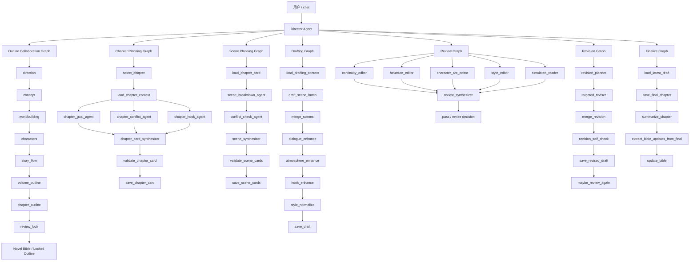
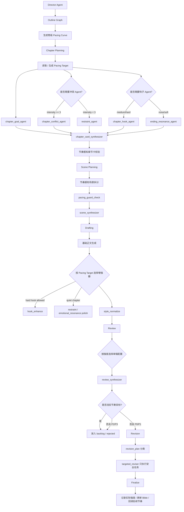
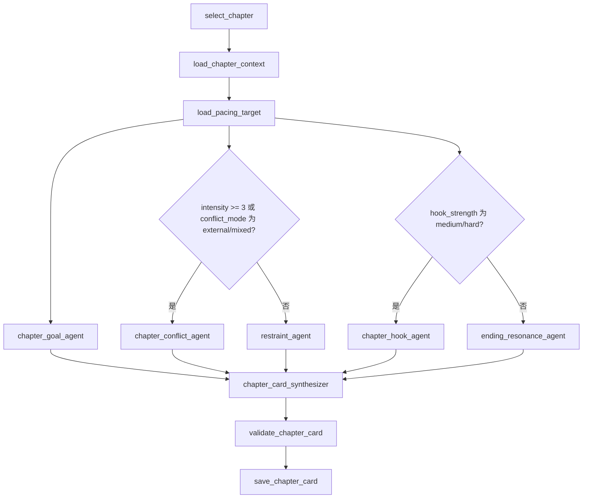
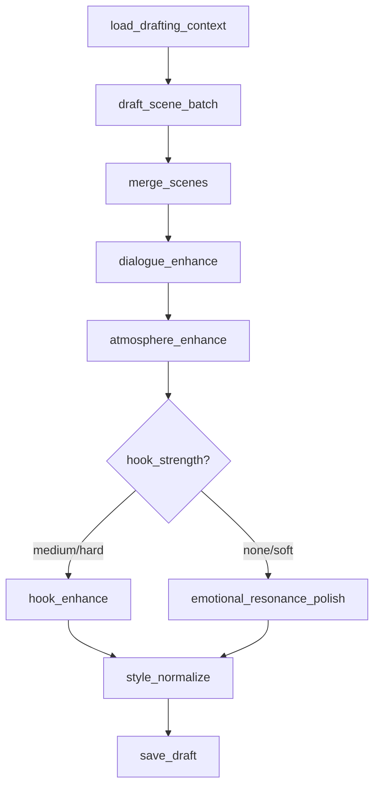

# AI Novelist LangGraph 节奏控制改造计划

> 版本：v1.0  
> 日期：2026-05-23  
> 目标项目：`hxfei-git/ai-novelist`  
> 核心目标：让小说从“每章都被冲突、钩子、转折强化”改造成“服从卷级节奏曲线，允许铺垫、低谷、余波、蓄势、高潮交替出现”。

---

## 0. 一句话结论

当前流程的问题不是“多 Agent 没用”，而是**多个 Agent 在不同层级重复强化同一类指标：冲突、钩子、转折、发展**。  

改造重点不应是简单删除 Agent，而是引入一个上位约束：

> **Pacing Target / 章节节奏目标**：每章先确定自己在整卷中的功能、强度、张力来源、结尾方式和禁止升级项，然后所有大纲、章节卡、场景卡、写作、审稿、修订流程都必须服从它。

换句话说，系统判断标准要从：

```text
这一章冲突够不够？
这一章钩子够不够？
这一章转折够不够？
```

改成：

```text
这一章是否完成了它在整卷节奏曲线中的功能？
```

---

## 1. 当前流程关系梳理

根据当前项目结构，主入口是 `chat`，由 Director Agent 根据用户意图调度各子图。整体关系可以整理为：



这个架构总体是合理的：

- Outline Graph 负责全局设定、故事流、卷纲、章纲。
- Chapter Planning Graph 负责单章目标和章节卡。
- Scene Planning Graph 负责把章节拆成可写场景。
- Drafting Graph 负责生成正文并做语言增强。
- Review Graph 负责多角度审稿。
- Revision Graph 负责按审稿任务定向修订。
- Finalize Graph 负责定稿、摘要和 Bible 回写。

真正的问题在于：**这些层级都在独立强化“冲突、钩子、转折”，但没有共同服从一个卷级节奏曲线。**

---

## 2. 当前冗余与副作用诊断

### 2.1 冲突、钩子、转折被多层重复强化

当前至少有五层会推高章节强度：

| 层级 | 当前强化点 | 可能副作用 |
|---|---|---|
| 大纲阶段 | 关系冲突、节奏悬念、卷内高潮、章节钩子 | 从全局设定阶段就倾向高密度事件 |
| 章节规划 | `chapter_conflict_agent`、`chapter_hook_agent`、`关键冲突`、`结尾钩子` | 每章都被迫拥有冲突和钩子 |
| 场景规划 | `conflict_check_agent`、`冲突对象`、`场景转折` | 每个场景都像小型冲突单元 |
| 写作增强 | `hook_enhance` 固定执行 | 低谷章、余波章也被改成悬念结尾 |
| 审稿修订 | structure/editor/reader 可能要求“更抓人” | 安静章节被误判为“不够推进” |

最终小说节奏容易变成：

```text
强冲突 → 强冲突 → 强冲突 → 强冲突 → 强冲突
```

而不是：

```text
铺垫 → 升压 → 小爆发 → 余波 → 低谷 → 蓄势 → 反转 → 高潮 → 缓冲 → 终局爆发
```

### 2.2 Schema 把“高潮型章节”的字段套给所有章节

当前章节卡固定要求类似字段：

```text
章节目标
场景列表
关键冲突
人物变化
结尾钩子
连续性约束
本章写作输入
自检
```

当前场景卡固定要求类似字段：

```text
地点
出场人物
场景目的
人物目标
冲突对象
关键信息
情绪变化
场景转折
退出状态
```

这些字段对商业高推进章节有效，但不适合所有章节。比如：

- 战后余波章不一定要有新冲突。
- 关系铺垫章不一定要有强转折。
- 低谷章不应该马上制造新爆点。
- 过渡章的作用可能只是移动位置、整理信息、重置目标。
- 蓄势章的价值是压住不爆，而不是提前高潮。

### 2.3 Synthesizer 容易变成“会议纪要员”

当前常见结构是：

```text
多个 Agent 给建议
  ↓
Synthesizer 汇总
  ↓
产物进入下游
```

如果 Synthesizer 没有“只采纳少量核心建议、拒绝不合节奏的建议、把过早信息延后”的约束，它会天然倾向于把所有 Agent 的信息都保留一点。

对小说来说，这很危险。因为主编的职责不是“合并所有建议”，而是：

```text
决定本章只完成什么。
决定哪些冲突压住。
决定哪些信息延后。
决定哪些建议不采纳。
决定本章不能发生什么。
```

### 2.4 审稿和修订缺少“节奏守门”

如果 Review Graph 不知道本章是低谷章、余波章还是铺垫章，它可能会把“安静但有效”误判为：

```text
冲突不足
不够抓人
缺少爆点
结尾不够有悬念
人物变化不明显
```

随后 Revision Graph 会把这些建议执行掉，导致原本应当降压的章节被修成升压章节。

---

## 3. 改造目标

### 3.1 总目标

建立一个贯穿全流程的节奏控制系统，让每章具有明确的章节功能和强度边界。

### 3.2 具体目标

1. 在大纲或章纲阶段生成卷级节奏曲线。
2. 每章拥有独立的 `PacingTarget`。
3. Chapter Plan、Scene Plan、Drafting、Review、Revision 都读取并服从 `PacingTarget`。
4. 冲突、钩子、转折类 Agent 改为条件运行。
5. Synthesizer 必须区分：采纳、拒绝、延后。
6. Review 只把真正阻塞逻辑的问题送入 Revision。
7. Revision 不执行会破坏本章节奏目标的建议。
8. Finalize 时记录实际强度，作为后续章节节奏回调依据。

### 3.3 不做的事情

本轮改造不建议一开始就做以下事情：

- 不直接删除所有多 Agent 结构。
- 不把所有图重写成一个大图。
- 不把所有 Prompt 全部推倒重来。
- 不引入复杂机器学习模型评估节奏。
- 不把“冲突”完全移除，而是让冲突服从章节功能。

---

## 4. 新核心概念：Pacing Target

### 4.1 定义

`PacingTarget` 是每章的节奏合同。它决定本章：

- 在整卷中的功能。
- 允许的强度上限。
- 张力来源。
- 是否允许强冲突。
- 是否允许硬钩子。
- 最多揭示多少关键信息。
- 不允许发生什么。
- 哪些建议应该延后。

### 4.2 推荐字段

```json
{
  "chapter": 12,
  "function": "aftermath",
  "intensity": 2,
  "conflict_mode": "latent",
  "hook_strength": "soft",
  "reveal_quota": 1,
  "setback_level": 1,
  "emotional_curve": "down_then_stable",
  "primary_progress": "character_state",
  "tension_source": "上一章失败后的沉默、未说出口的愧疚、队伍信任裂缝",
  "ending_mode": "soft_resonance",
  "must_have": [
    "呈现上一章代价",
    "让主角从麻木过渡到重新行动",
    "保留一个轻微不安的细节"
  ],
  "must_not": [
    "不要新增外部袭击",
    "不要制造重大背叛",
    "不要硬结尾钩子",
    "不要提前揭示核心秘密"
  ],
  "defer_to_later": [
    "敌方真正计划",
    "主角身世真相",
    "队友正面决裂"
  ]
}
```

### 4.3 字段说明

| 字段 | 类型 | 说明 |
|---|---|---|
| `chapter` | int | 章节序号 |
| `function` | enum | 本章功能，如 setup/build/breather/aftermath/twist/climax/resolution |
| `intensity` | int 1-5 | 本章目标强度 |
| `conflict_mode` | enum | none/latent/internal/external/mixed |
| `hook_strength` | enum | none/soft/medium/hard |
| `reveal_quota` | int | 本章最多揭示几个关键新信息 |
| `setback_level` | int 0-5 | 主角受挫程度 |
| `emotional_curve` | string | 情绪曲线，如 rise/fall/down_then_stable |
| `primary_progress` | enum | 情节、人物、关系、信息、氛围、位置转移等 |
| `tension_source` | string | 本章张力来源，不等同于显性冲突 |
| `ending_mode` | enum | soft_resonance/question/hard_hook/cliffhanger/closure |
| `must_have` | list[str] | 本章必须完成的功能 |
| `must_not` | list[str] | 本章禁止出现的升级行为 |
| `defer_to_later` | list[str] | 有价值但应延后的信息或冲突 |

### 4.4 强度定义

| 强度 | 功能定位 | 允许内容 | 禁止内容 |
|---|---|---|---|
| 1 | 静态余波 / 情绪沉淀 | 情绪变化、关系微变、信息整理 | 新危机、强反转、硬钩子 |
| 2 | 铺垫 / 低压过渡 | 暗示、软悬念、目标转移 | 正面对抗升级、重大揭示 |
| 3 | 常规推进 | 局部冲突、中等转折、明确目标变化 | 卷级高潮、连续强爆点 |
| 4 | 小高潮 / 强转折 | 明显冲突、代价、反转 | 把终局秘密全部揭完 |
| 5 | 高潮 / 摊牌 / 终局爆发 | 强对抗、重大代价、硬钩子 | 过多解释、无代价胜利 |

---

## 5. 目标架构

### 5.1 改造后整体流程



### 5.2 新增关键机制

| 机制 | 作用 |
|---|---|
| Pacing Curve | 卷级章节强度曲线 |
| Pacing Target | 单章节奏合同 |
| Conditional Agent Routing | 冲突/钩子/审稿 Agent 条件运行 |
| Pacing-aware Validation | 校验字段按章节功能变化 |
| Rejected Suggestions | 正式记录不采纳建议 |
| Backlog Suggestions | 有价值但延后的建议 |
| Pacing Guard Review | 检查是否过度升压 |
| Actual Intensity Tracking | 定稿后记录实际强度，反馈给后续章节 |

---

## 6. 各流程改造方案

## 6.1 Outline Graph 改造

### 当前问题

Outline 阶段已经包含故事流、卷纲、章纲，但缺少一个明确的“章节节奏曲线”产物。后续章节规划只能看到“这一章要发生什么”，却不知道“这一章应该有多强”。

### 改造目标

在 `story_flow` 或 `chapter_outline` 阶段生成 `Pacing Curve`。

### 推荐新增产物

文件建议：

```text
projects/<project>/outline/pacing_curve.json
projects/<project>/outline/pacing_curve.md
```

或写入已有 outline artifact：

```text
outline_stage_artifacts["pacing_curve"]
```

### Pacing Curve 示例

```json
{
  "volume": 1,
  "chapters": [
    {
      "chapter": 1,
      "function": "setup",
      "intensity": 2,
      "primary_progress": "world_and_character",
      "hook_strength": "soft",
      "notes": "建立主角处境和核心缺口，不制造大爆点"
    },
    {
      "chapter": 2,
      "function": "build",
      "intensity": 3,
      "primary_progress": "plot",
      "hook_strength": "medium",
      "notes": "引入外部压力，但不进入正面摊牌"
    },
    {
      "chapter": 3,
      "function": "breather",
      "intensity": 2,
      "primary_progress": "relationship",
      "hook_strength": "soft",
      "notes": "降低事件压力，推进人物关系和暗线"
    },
    {
      "chapter": 4,
      "function": "twist",
      "intensity": 4,
      "primary_progress": "reveal",
      "hook_strength": "hard",
      "notes": "第一次认知反转"
    },
    {
      "chapter": 5,
      "function": "aftermath",
      "intensity": 1,
      "primary_progress": "emotion",
      "hook_strength": "none",
      "notes": "呈现上一章代价，不新增危机"
    }
  ]
}
```

### Prompt 修改规则

在 `story_flow` 或 `chapter_outline` 的 synthesizer prompt 中加入：

```text
必须输出卷级节奏曲线。
每章必须标注：function、intensity、primary_progress、hook_strength、conflict_mode。
不允许连续三章 intensity >= 4，除非用户明确要求高压快节奏。
每个高潮或反转后，至少规划一个 aftermath/breather/resolution 类型章节或场景段落。
低强度章节的成功标准不是冲突强，而是情绪、关系、信息或氛围推进有效。
```

### 验收标准

- `chapter_outline` 之后能查到每章 `function` 和 `intensity`。
- 后续 `plan_chapter` 可以读取对应章节的 Pacing Target。
- 章纲里不再只有“事件列表”，而有“节奏功能”。

---

## 6.2 Chapter Planning Graph 改造

### 当前问题

当前章节规划固定运行：

```text
chapter_goal_agent
chapter_conflict_agent
chapter_hook_agent
chapter_card_synthesizer
```

这会让所有章节都被强制考虑冲突和钩子。

### 改造目标

章节规划先读取或生成 `PacingTarget`，再决定运行哪些 Agent。

### 新流程



### 推荐新增 Agent

#### `chapter_pacing_agent`

职责：如果大纲里没有明确节奏目标，则根据章纲和前后章节推断本章 Pacing Target。

输出：只输出 JSON。

```json
{
  "chapter": 3,
  "function": "breather",
  "intensity": 2,
  "conflict_mode": "latent",
  "hook_strength": "soft",
  "primary_progress": "relationship",
  "must_not": ["不要新增外部危机", "不要硬钩子"]
}
```

#### `restraint_agent`

职责：当本章是低强度、余波、铺垫或蓄势时，检查哪些建议不应该执行。

输出示例：

```json
{
  "advice": [
    "本章应避免正面冲突升级",
    "可用人物沉默、误解、旧物件来制造低压张力",
    "结尾宜软收束，不要 cliffhanger"
  ],
  "must_not": [
    "不要让反派直接登场袭击",
    "不要让主角立刻发现核心真相"
  ]
}
```

#### `ending_resonance_agent`

职责：为不需要硬钩子的章节设计“余味式结尾”。

结尾类型可以是：

```text
soft_resonance：情绪余味
quiet_question：轻微疑问
image_echo：意象回环
relationship_shift：关系微变
decision_seed：微小决定
```

### Chapter Card 新 Schema

建议替换原固定字段：

```text
章节目标
场景列表
关键冲突
人物变化
结尾钩子
连续性约束
本章写作输入
自检
```

改为：

```text
本章功能
目标强度
节奏位置
主要推进
张力来源
信息增量
人物状态变化
情绪曲线
结尾方式
连续性约束
禁止升级项
延后信息
本章写作输入
自检
```

### 字段说明

| 字段 | 是否必填 | 说明 |
|---|---|---|
| 本章功能 | 必填 | setup/build/breather/aftermath/twist/climax 等 |
| 目标强度 | 必填 | 1-5 |
| 节奏位置 | 必填 | 上升、下降、蓄势、爆发、余波等 |
| 主要推进 | 必填 | 情节、人物、关系、信息、氛围、位置转移等 |
| 张力来源 | 必填 | 可以是冲突、秘密、误解、压力、倒计时、沉默等 |
| 信息增量 | 必填 | 本章新增或重释的信息 |
| 人物状态变化 | 必填 | 不要求爆发式成长，可以是微变 |
| 情绪曲线 | 必填 | 本章读者情绪走向 |
| 结尾方式 | 必填 | 不等于钩子，可为软收束 |
| 连续性约束 | 必填 | 与前后文、Bible、设定的约束 |
| 禁止升级项 | 必填 | 不允许本章发生的内容 |
| 延后信息 | 必填 | 有价值但不在本章揭示的信息 |
| 本章写作输入 | 必填 | 给正文写作的指令 |
| 自检 | 必填 | 本章是否遵守 pacing target |

### 条件字段

仅当 `intensity >= 3` 时要求：

```text
关键冲突
显性对抗
```

仅当 `hook_strength in ["medium", "hard"]` 时要求：

```text
结尾钩子
悬念设计
```

仅当 `function in ["aftermath", "breather", "setup"]` 时要求：

```text
降压策略
余味设计
禁止升级项
```

### `validate_chapter_card` 修改思路

当前校验逻辑是固定检查 `CHAPTER_CARD_SECTIONS`。建议改为动态：

```python
def required_chapter_sections(pacing: PacingTarget) -> list[str]:
    base = [
        "本章功能",
        "目标强度",
        "节奏位置",
        "主要推进",
        "张力来源",
        "信息增量",
        "人物状态变化",
        "情绪曲线",
        "结尾方式",
        "连续性约束",
        "禁止升级项",
        "延后信息",
        "本章写作输入",
        "自检",
    ]

    if pacing.intensity >= 3:
        base.append("关键冲突")

    if pacing.hook_strength in {"medium", "hard"}:
        base.append("结尾钩子")

    if pacing.function in {"breather", "aftermath", "setup"}:
        base.append("降压策略")

    return base
```

### Chapter Card Synthesizer Prompt 核心规则

```text
你不是会议纪要员，而是主编。
不要汇总所有 Agent 建议。
只采纳最符合 Pacing Target 的 1-3 个核心建议。

必须输出：
1. adopted_suggestions：采纳的建议。
2. rejected_suggestions：不采纳的建议，并说明违反了哪条 pacing 约束。
3. deferred_suggestions：有价值但延后到后续章节的建议。
4. must_not：本章禁止出现的升级项。

如果 Agent 建议会让章节强度超过目标强度，必须拒绝或延后。
低强度章节不应因为缺少硬冲突而被补硬冲突。
```

---

## 6.3 Scene Planning Graph 改造

### 当前问题

场景字段固定包含：

```text
冲突对象
场景转折
```

这会让每个场景都被设计成冲突单元，不利于低谷、过渡、余波和氛围场景。

### 改造目标

把“冲突对象 / 场景转折”降级为条件字段，把“张力来源 / 微变化”提升为基础字段。

### 新 Scene Card Schema

```text
场景编号
地点
出场人物
场景目的
人物目标
张力来源
关键信息
情绪变化
微变化 / 转折
退出状态
节奏约束
禁止升级项
```

### 条件字段

```python
def required_scene_fields(pacing: PacingTarget) -> list[str]:
    fields = [
        "场景编号",
        "地点",
        "出场人物",
        "场景目的",
        "人物目标",
        "张力来源",
        "关键信息",
        "情绪变化",
        "微变化 / 转折",
        "退出状态",
        "节奏约束",
        "禁止升级项",
    ]

    if pacing.intensity >= 3:
        fields.extend(["冲突对象", "显性阻力"])

    if pacing.function in {"twist", "climax"}:
        fields.append("强转折")

    return fields
```

### `conflict_check_agent` 改造

把 `conflict_check_agent` 改成 `tension_check_agent` 或 `pacing_guard_agent`。

职责从：

```text
检查场景冲突是否足够。
```

改为：

```text
检查场景张力是否符合本章 Pacing Target。
高强度章节：检查冲突是否足够。
低强度章节：检查是否过度冲突、过早爆发、硬造转折。
```

### 低强度场景示例

```markdown
## 场景 2

- 地点：废弃观测站走廊
- 出场人物：主角、队友 A
- 场景目的：呈现上一章失败后的沉默代价
- 人物目标：主角想避免谈论牺牲者，队友 A 想确认他是否还能继续行动
- 张力来源：双方都知道问题存在，但都不说破
- 关键信息：牺牲者留下的记录器仍在闪烁
- 情绪变化：压抑 → 短暂接近 → 再次退开
- 微变化：主角第一次没有把记录器扔掉，而是收进衣袋
- 退出状态：队友 A 不再追问，但信任尚未恢复
- 节奏约束：保持低压，不新增敌袭
- 禁止升级项：不揭示记录器内容，不爆发争吵
```

### Scene Synthesizer Prompt 核心规则

```text
不要把每个场景都写成正面对抗。
低强度章节的场景必须有“微变化”，但不要求强转折。
张力可以来自沉默、误解、时间压力、信息不对称、旧伤、未完成承诺。
如果本章 intensity <= 2，禁止新增袭击、背叛、爆炸、摊牌、重大秘密揭示。
```

---

## 6.4 Drafting Graph 改造

### 当前问题

当前写作增强链路类似：

```text
merge_scenes
  ↓
dialogue_enhance
  ↓
atmosphere_enhance
  ↓
hook_enhance
  ↓
style_normalize
```

`hook_enhance` 固定执行，会把不需要硬钩子的章节也推向悬念结尾。

### 改造目标

按 `PacingTarget` 动态选择增强器。

### 新流程



### 推荐新增增强器

#### `restraint_polisher`

用于低谷、余波、铺垫章。

职责：

```text
压住过度解释、过度冲突、过度爆点。
保留情绪余味和人物微变化。
不新增重大事件。
```

#### `emotional_resonance_polisher`

用于低强度但需要读者有余味的章节。

职责：

```text
强化意象回环、情绪尾音、人物潜台词。
不制造硬悬念。
```

#### `quiet_tension_polisher`

用于蓄势章节。

职责：

```text
让压力存在但不爆发。
增强信息不对称、倒计时、环境暗示。
不提前揭示核心秘密。
```

### Enhancer 通用硬约束

所有 Enhancer Prompt 都应加入：

```text
必须服从 Pacing Target。
不得新增 Pacing Target 未允许的重大冲突、反转、揭示、袭击、背叛、死亡、爆炸或硬钩子。
不得让章节强度超过目标强度。
如果发现原文已经过度升压，应优先降压，而不是继续增强。
```

### 建议改进：从整章覆盖改为 Patch 输出

当前增强器如果每轮都覆盖整章，容易造成漂移。建议中期改成 Patch 模式。

Patch 输出示例：

```json
{
  "patches": [
    {
      "target": "结尾后三段",
      "operation": "replace",
      "reason": "原结尾制造了硬悬念，违反 hook_strength=soft",
      "new_text": "……"
    }
  ],
  "pacing_check": {
    "target_intensity": 2,
    "estimated_intensity_after_patch": 2,
    "violations": []
  }
}
```

第一阶段可以先保留整章覆盖，但必须加强 Prompt 约束；第二阶段再做 Patch 化。

---

## 6.5 Review Graph 改造

### 当前问题

当前多编辑审稿固定运行：

```text
continuity_editor
structure_editor
character_arc_editor
style_editor
simulated_reader
```

这对高强度章节有效，但对低谷和余波章节容易误判。

### 改造目标

按章节强度选择审稿配置，并加入 `pacing_guard_editor`。

### 审稿配置建议

| 章节类型 | intensity | 推荐审稿 Agent |
|---|---:|---|
| setup / breather / aftermath | 1-2 | continuity_editor、style_editor、pacing_guard_editor、emotional_resonance_editor |
| build / investigation / transition | 3 | continuity_editor、structure_editor、character_arc_editor、style_editor、pacing_guard_editor |
| twist / climax / finale | 4-5 | continuity_editor、structure_editor、character_arc_editor、style_editor、simulated_reader、pacing_guard_editor |

### 新增 `pacing_guard_editor`

职责：

```text
检查章节是否违反 Pacing Target。
如果章节过度升压，指出哪些段落制造了不该有的冲突、转折或钩子。
如果章节强度不足，也只在目标强度允许范围内提出建议。
```

输出示例：

```json
{
  "estimated_actual_intensity": 4,
  "target_intensity": 2,
  "violations": [
    {
      "type": "over_escalation",
      "evidence": "结尾新增反派袭击，违反 must_not: 不新增外部危机",
      "severity": "P1",
      "fix": "删除袭击，改为记录器闪烁的软悬念"
    }
  ],
  "safe_suggestions": [
    "保留主角收起记录器的动作作为微变化"
  ]
}
```

### Review Synthesizer 修改规则

审稿汇总必须分级：

| 级别 | 定义 | 是否进入 Revision |
|---|---|---|
| P0 | 逻辑断裂、设定冲突、人物行为严重不成立 | 是 |
| P1 | 明显影响读者理解或破坏 Pacing Target | 是 |
| P2 | 可改善但非阻塞 | 默认否，进入可选 |
| P3 | 主观偏好或风格建议 | 否，进入 backlog |

必须新增三类输出：

```json
{
  "blocking_fixes": [],
  "pacing_safe_fixes": [],
  "backlog_suggestions": [],
  "rejected_suggestions": []
}
```

### 关键规则

```text
低强度章节不能因为“没有强冲突”被判失败。
只有当低强度章节缺少情绪变化、信息增量、人物状态变化或节奏功能时，才算结构问题。
任何会让章节超过 target_intensity 的建议，必须进入 backlog 或 rejected_suggestions。
review_synthesizer 不得新增五个 editor 未提出的问题。
```

---

## 6.6 Revision Graph 改造

### 当前问题

Revision Graph 会根据 review report 生成修订计划并执行。如果 review report 把“增强冲突、加强钩子”作为任务传入，修订流程就会执行，导致节奏漂移。

### 改造目标

修订计划必须分为：

```text
blocking_fixes
pacing_safe_fixes
backlog_suggestions
rejected_suggestions
```

只有前两类允许进入正文修订。

### 新 Revision Plan Schema

```json
{
  "chapter": 5,
  "pacing_target": {
    "function": "aftermath",
    "intensity": 1,
    "hook_strength": "none"
  },
  "blocking_fixes": [
    {
      "id": "fix-001",
      "severity": "P0",
      "target": "第三场",
      "problem": "角色知道了自己不该知道的信息",
      "instruction": "删除这句台词，改为模糊猜测"
    }
  ],
  "pacing_safe_fixes": [
    {
      "id": "fix-002",
      "severity": "P1",
      "target": "结尾",
      "problem": "结尾硬造敌袭，超过目标强度",
      "instruction": "改为安静的不安细节，不出现敌人"
    }
  ],
  "backlog_suggestions": [
    {
      "id": "backlog-001",
      "reason": "增强反派正面威胁适合第 7 章小高潮，不适合本章余波"
    }
  ],
  "rejected_suggestions": [
    {
      "id": "reject-001",
      "reason": "让队友当场背叛违反 must_not"
    }
  ]
}
```

### Targeted Reviser 约束

```text
只执行 blocking_fixes 和 pacing_safe_fixes。
不得执行 backlog_suggestions。
不得执行 rejected_suggestions。
不得自行新增冲突、钩子、反转、死亡、背叛、秘密揭示。
修订后必须输出 pacing_self_check。
```

### Revision Self Check 增强

新增检查：

```json
{
  "pacing_self_check": {
    "target_intensity": 2,
    "estimated_actual_intensity": 2,
    "hook_strength_target": "soft",
    "hook_strength_actual": "soft",
    "violations": [],
    "notes": "修订未新增外部危机"
  }
}
```

---

## 6.7 Finalize Graph 改造

### 当前问题

Finalize 目前主要负责保存定稿、摘要和更新 Bible。建议额外记录“实际节奏结果”。

### 改造目标

定稿后提取：

```text
actual_intensity
actual_function
actual_hook_strength
actual_reveals
unresolved_threads
pacing_deviation
```

### 新增产物

```text
projects/<project>/chapters/chapter_005/pacing_report.json
```

示例：

```json
{
  "chapter": 5,
  "target": {
    "function": "aftermath",
    "intensity": 1,
    "hook_strength": "none"
  },
  "actual": {
    "function": "aftermath",
    "intensity": 2,
    "hook_strength": "soft"
  },
  "deviation": {
    "intensity_delta": 1,
    "acceptable": true,
    "reason": "结尾保留轻微不安细节，但未制造硬钩子"
  },
  "carry_forward": [
    "记录器内容未揭示",
    "队友 A 对主角信任降低"
  ]
}
```

### 后续节奏回调

如果连续章节实际强度高于目标，应提醒 Director：

```text
最近 3 章实际强度均高于目标，建议下一章改为 breather/aftermath，或降低 hook_strength。
```

如果连续章节强度过低，也可以提醒：

```text
最近 3 章实际强度偏低，建议下一章进入 build/twist，增加显性目标或局部冲突。
```

---

## 7. 代码改动清单

## 7.1 新增文件：`src/ai_novelist/pacing.py`

建议职责：

```text
定义 PacingTarget。
定义 PacingCurve。
从 chapter_card 中解析 pacing 信息。
从 outline artifacts 中读取 pacing curve。
提供 fallback 推断。
提供章节强度和 hook 规则判断。
```

示例骨架：

```python
from __future__ import annotations

from dataclasses import dataclass, field
from typing import Literal

ChapterFunction = Literal[
    "setup",
    "build",
    "breather",
    "aftermath",
    "transition",
    "twist",
    "climax",
    "resolution",
]

ConflictMode = Literal["none", "latent", "internal", "external", "mixed"]
HookStrength = Literal["none", "soft", "medium", "hard"]

@dataclass
class PacingTarget:
    chapter: int
    function: ChapterFunction = "build"
    intensity: int = 3
    conflict_mode: ConflictMode = "mixed"
    hook_strength: HookStrength = "soft"
    reveal_quota: int = 1
    setback_level: int = 1
    emotional_curve: str = "neutral_to_forward"
    primary_progress: str = "plot"
    tension_source: str = ""
    ending_mode: str = "soft_resonance"
    must_have: list[str] = field(default_factory=list)
    must_not: list[str] = field(default_factory=list)
    defer_to_later: list[str] = field(default_factory=list)

    @property
    def allows_hard_conflict(self) -> bool:
        return self.intensity >= 3 and self.conflict_mode in {"external", "mixed"}

    @property
    def allows_hook_enhance(self) -> bool:
        return self.hook_strength in {"medium", "hard"}

    @property
    def is_quiet_chapter(self) -> bool:
        return self.intensity <= 2 or self.function in {"breather", "aftermath", "setup"}


def clamp_intensity(value: int) -> int:
    return max(1, min(5, value))
```

## 7.2 修改 `NovelState`

建议增加字段：

```python
current_pacing_target: dict = field(default_factory=dict)
pacing_curve: dict = field(default_factory=dict)
pacing_backlog: list[dict] = field(default_factory=list)
actual_intensity_history: list[dict] = field(default_factory=list)
```

如果不想立即改 State，也可以先放在：

```python
state.director_task_args["pacing_target"]
state.director_task_args["pacing_curve"]
```

但长期建议进入 `NovelState`。

## 7.3 修改 `graph_outline.py`

任务：

- 在 `story_flow` 或 `chapter_outline` 阶段要求输出 pacing curve。
- 保存 `pacing_curve.json`。
- 将 pacing curve 注册到 artifact registry。

建议新增函数：

```python
def extract_pacing_curve_from_outline(synthesis: str) -> dict:
    ...


def save_pacing_curve_node(data: dict, store: LocalStore) -> dict:
    ...
```

## 7.4 修改 `graph_chapter_plan.py`

任务：

- 新增 `load_pacing_target_node`。
- `run_chapter_planning_agents_node` 按 pacing target 动态选择 Agent。
- 替换固定 `CHAPTER_CARD_SECTIONS` 为动态函数。
- `format_reports` 增加 restraint/ending resonance 报告。
- synthesizer prompt 注入 pacing target。

建议伪代码：

```python
def select_chapter_agent_specs(pacing: PacingTarget) -> list[tuple[str, str]]:
    specs = [("chapter_goal_report", "chapter_goal_agent")]

    if pacing.allows_hard_conflict:
        specs.append(("chapter_conflict_report", "chapter_conflict_agent"))
    else:
        specs.append(("chapter_restraint_report", "restraint_agent"))

    if pacing.allows_hook_enhance:
        specs.append(("chapter_hook_report", "chapter_hook_agent"))
    else:
        specs.append(("chapter_ending_report", "ending_resonance_agent"))

    return specs
```

## 7.5 修改 `graph_scene.py`

任务：

- 将固定 `SCENE_FIELDS` 改为动态字段。
- 将 `conflict_check_agent` 改成 `tension_check_agent` 或 `pacing_guard_agent`。
- 场景合成 Prompt 注入 pacing target。
- 低强度章节校验“是否过度冲突”，而不是“冲突是否不足”。

## 7.6 修改 `graph_drafting.py`

任务：

- `hook_enhance` 改为条件执行。
- 新增 `restraint_polisher`、`emotional_resonance_polisher`、`quiet_tension_polisher`。
- Enhancer Prompt 注入 pacing target 和 must_not。
- 中期改成 Patch 输出，减少整章重写漂移。

伪代码：

```python
def route_after_atmosphere(state: dict) -> str:
    pacing = get_pacing_target(state)
    if pacing.allows_hook_enhance:
        return "hook_enhance"
    if pacing.function == "aftermath":
        return "emotional_resonance_polish"
    if pacing.function in {"setup", "breather"}:
        return "restraint_polish"
    return "style_normalize"
```

## 7.7 修改 `graph_review.py`

任务：

- 审稿 Agent 按 pacing target 动态选择。
- 新增 `pacing_guard_editor`。
- review_synthesizer 输出 severity、blocking_fixes、pacing_safe_fixes、backlog_suggestions、rejected_suggestions。
- 低强度章节不因缺少硬冲突失败。

伪代码：

```python
def select_review_agents(pacing: PacingTarget) -> list[str]:
    if pacing.intensity <= 2:
        return [
            "continuity_editor",
            "style_editor",
            "pacing_guard_editor",
            "emotional_resonance_editor",
        ]

    if pacing.intensity == 3:
        return [
            "continuity_editor",
            "structure_editor",
            "character_arc_editor",
            "style_editor",
            "pacing_guard_editor",
        ]

    return [
        "continuity_editor",
        "structure_editor",
        "character_arc_editor",
        "style_editor",
        "simulated_reader",
        "pacing_guard_editor",
    ]
```

## 7.8 修改 `graph_revision.py`

任务：

- Revision Plan 分类。
- Targeted Reviser 只执行 blocking_fixes 和 pacing_safe_fixes。
- Revision Self Check 增加 pacing_self_check。
- backlog_suggestions 写入 state 或 artifact，但不进入正文。

## 7.9 修改 Prompt 文件

需要新增或修改的 Prompt：

```text
prompts/chapter_pacing_agent.md
prompts/restraint_agent.md
prompts/ending_resonance_agent.md
prompts/pacing_guard_editor.md
prompts/emotional_resonance_editor.md
prompts/restraint_polisher.md
prompts/emotional_resonance_polisher.md
prompts/quiet_tension_polisher.md

prompts/chapter_card_synthesizer.md
prompts/scene_synthesizer.md
prompts/review_synthesizer.md
prompts/revision_planner.md
prompts/targeted_reviser.md
prompts/hook_enhancer.md
```

---

## 8. 全局 Prompt 片段

## 8.1 Pacing Discipline

建议所有综合、写作、审稿、修订类 Agent 都加入：

```text
## Pacing Discipline

你必须服从 Pacing Target。
Pacing Target 的优先级高于局部 Agent 建议。

如果本章 intensity <= 2：
- 禁止新增重大外部危机。
- 禁止新增硬反转。
- 禁止制造 cliffhanger 式硬钩子。
- 禁止让人物关系立即爆炸，除非 Pacing Target 明确允许。
- 可以通过沉默、误解、旧伤、信息不对称、意象回环、关系微变制造张力。

如果本章 intensity == 3：
- 允许局部冲突和中等转折。
- 不允许升级为卷级高潮。

如果本章 intensity >= 4：
- 允许强冲突、明显代价、强转折。
- 仍不得提前揭示 defer_to_later 中的信息。
```

## 8.2 Synthesizer Rule

```text
## Synthesizer Rule

你不是会议纪要员，而是主编。
不要合并所有 Agent 建议。
你必须做取舍。

输出必须包含：
1. adopted_suggestions：采纳的 1-3 个核心建议。
2. rejected_suggestions：拒绝的建议，并说明原因。
3. deferred_suggestions：有价值但延后的建议。
4. pacing_rationale：为什么这样安排符合 Pacing Target。

任何违反 Pacing Target 的建议，不得进入正文任务。
```

## 8.3 Review Gate Rule

```text
## Review Gate Rule

审稿时必须先判断章节是否完成 Pacing Target。
不要用高强度章节的标准评价低强度章节。

低强度章节的成功标准：
- 是否有情绪变化。
- 是否有信息增量或旧信息重释。
- 是否有人物状态微变。
- 是否产生余味或蓄势。
- 是否没有提前爆发。

只有 P0/P1 问题可以进入修订任务。
P2/P3 建议进入 backlog。
```

## 8.4 Revision Safety Rule

```text
## Revision Safety Rule

只执行 blocking_fixes 和 pacing_safe_fixes。
不得执行 backlog_suggestions。
不得执行 rejected_suggestions。
不得自行新增冲突、钩子、反转、背叛、死亡、秘密揭示。
修订后必须给出 pacing_self_check。
```

---

## 9. 分阶段实施计划

## Phase 0：基线记录与回归样本

### 目标

在改造前固定现有行为，避免改完后无法判断效果。

### 任务

1. 选择 1 个 mock 项目和 1 个真实模型项目作为样本。
2. 生成至少 6 章或 1 卷章节卡。
3. 保存当前 chapter_card、scene_cards、draft、review、revision_plan。
4. 人工标记每章实际强度。

### 产物

```text
baseline/pacing_baseline_report.md
baseline/chapter_intensity_table.csv
```

### 验收

有一份表格记录：

```text
章节 | 当前功能 | 当前实际强度 | 是否硬钩子 | 是否新增冲突 | 人工评价
```

---

## Phase 1：先改 Prompt 和章节卡 Schema

### 目标

用最小代码变更解决 50% 的问题。

### 任务

1. 修改 `CHAPTER_CARD_SECTIONS`。
2. 新增章节卡字段：本章功能、目标强度、张力来源、结尾方式、禁止升级项、延后信息。
3. 修改 chapter_card_synthesizer prompt，加入 Synthesizer Rule。
4. 修改 scene_synthesizer prompt，加入“张力来源不等于冲突”。
5. 修改 hook_enhancer prompt，加入“不得新增硬钩子”的约束。
6. 修改 review_synthesizer prompt，加入 P0/P1/P2/P3 分级。

### 代码改动少的原因

这一阶段可以暂时不做动态路由，只先让现有 Agent 在输出时服从节奏字段。

### 验收

- 章节卡不再固定只有“关键冲突、结尾钩子”。
- Synthesizer 会输出 rejected/deferred suggestions。
- 低强度章不会被 prompt 主动补硬冲突。

---

## Phase 2：引入 Pacing Target 和动态章节规划

### 目标

让章节规划先有节奏目标，再选择 Agent。

### 任务

1. 新增 `pacing.py`。
2. 新增 `PacingTarget` 数据结构。
3. 新增 `load_pacing_target_node`。
4. 新增 `chapter_pacing_agent`。
5. 新增 `restraint_agent` 和 `ending_resonance_agent`。
6. `run_chapter_planning_agents_node` 改为动态选择 Agent。
7. `validate_chapter_card_node` 改为动态字段校验。

### 验收

- `intensity <= 2` 时不运行 `chapter_conflict_agent`，或其职责变为“避免过度冲突”。
- `hook_strength in [none, soft]` 时不运行 `chapter_hook_agent`，改运行 `ending_resonance_agent`。
- chapter_card 明确写出 `must_not` 和 `defer_to_later`。

---

## Phase 3：改造场景规划和写作增强

### 目标

阻断“场景层”和“写作增强层”的自动升压。

### 任务

1. `SCENE_FIELDS` 改为动态字段。
2. `conflict_check_agent` 改为 `pacing_guard_agent` 或 `tension_check_agent`。
3. 低强度章节要求“微变化”，不要求“强转折”。
4. `hook_enhance` 改成条件执行。
5. 新增低强度章节增强器：`restraint_polisher`、`emotional_resonance_polisher`。
6. 所有 drafting enhancer 注入 pacing target。

### 验收

- aftermath/breather 章节不会自动生成外部袭击或硬钩子。
- 场景卡允许“张力来源：沉默/误解/信息不对称”。
- 低强度章节正文结尾可以软收束。

---

## Phase 4：改造审稿和修订

### 目标

防止审稿和修订把低强度章节修成高强度章节。

### 任务

1. 新增 `pacing_guard_editor`。
2. Review Agent 按 `PacingTarget` 动态选择。
3. Review Synthesizer 输出 `blocking_fixes`、`pacing_safe_fixes`、`backlog_suggestions`、`rejected_suggestions`。
4. Revision Planner 只接收 P0/P1。
5. Targeted Reviser 只执行允许任务。
6. Revision Self Check 增加 pacing_self_check。

### 验收

- 低强度章节不会因“冲突不足”直接 fail。
- “增强钩子 / 增强冲突 / 增加反转”类建议在不合节奏时进入 backlog。
- 修订后实际强度不超过目标强度 + 1。

---

## Phase 5：Finalize 回写与长期节奏调度

### 目标

让系统具备“整卷节奏记忆”。

### 任务

1. Finalize 生成 `pacing_report.json`。
2. 记录 `actual_intensity`、`actual_hook_strength`、`actual_reveals`。
3. 将偏差信息写回 Novel Bible 或 state。
4. Director 在下一章规划时读取最近 3 章实际强度。
5. 如果连续升压，建议下一章降压；如果连续低压，建议进入 build/twist。

### 验收

- 连续三章强度偏高时，系统能主动建议 breather/aftermath。
- 连续三章强度偏低时，系统能主动建议 build/twist。
- 导出的 novel_bible 能看到章节节奏轨迹。

---

## 10. 测试计划

## 10.1 单元测试

建议新增测试文件：

```text
tests/test_pacing_target.py
tests/test_chapter_plan_pacing.py
tests/test_scene_pacing.py
tests/test_review_pacing.py
tests/test_revision_pacing.py
```

### 测试 1：低强度章不运行冲突 Agent

```python
def test_quiet_chapter_uses_restraint_agent():
    pacing = PacingTarget(chapter=3, function="breather", intensity=2, hook_strength="soft")
    specs = select_chapter_agent_specs(pacing)
    agent_names = [name for _, name in specs]

    assert "chapter_conflict_agent" not in agent_names
    assert "restraint_agent" in agent_names
    assert "chapter_hook_agent" not in agent_names
    assert "ending_resonance_agent" in agent_names
```

### 测试 2：高潮章运行冲突和钩子 Agent

```python
def test_climax_chapter_uses_conflict_and_hook_agents():
    pacing = PacingTarget(chapter=10, function="climax", intensity=5, hook_strength="hard", conflict_mode="external")
    specs = select_chapter_agent_specs(pacing)
    agent_names = [name for _, name in specs]

    assert "chapter_conflict_agent" in agent_names
    assert "chapter_hook_agent" in agent_names
```

### 测试 3：低强度章节卡不强制关键冲突

```python
def test_required_sections_for_aftermath_do_not_require_key_conflict():
    pacing = PacingTarget(chapter=5, function="aftermath", intensity=1, hook_strength="none")
    sections = required_chapter_sections(pacing)

    assert "关键冲突" not in sections
    assert "结尾钩子" not in sections
    assert "降压策略" in sections
```

### 测试 4：Review Synthesizer 不把 P2/P3 送入修订

```python
def test_review_only_blocks_p0_p1():
    report = synthesize_review_reports(mock_editor_reports)

    assert all(item["severity"] in {"P0", "P1"} for item in report["blocking_fixes"])
    assert all(item["severity"] in {"P2", "P3"} for item in report["backlog_suggestions"])
```

### 测试 5：Revision 不执行 backlog

```python
def test_revision_ignores_backlog_suggestions():
    plan = build_revision_plan(review_report_with_backlog)
    executable = get_executable_revision_tasks(plan)

    assert all(task["id"].startswith("fix-") for task in executable)
    assert not any(task["id"].startswith("backlog-") for task in executable)
```

## 10.2 集成测试

### 场景 A：余波章

输入：

```text
第 5 章是上一章失败后的余波，强度 1，不要新增危机。
```

期望：

- chapter_card 标注 `function=aftermath`。
- 不出现硬钩子。
- scene_cards 以情绪和关系变化为主。
- review 不因冲突不足 fail。
- revision 不新增敌袭。

### 场景 B：蓄势章

输入：

```text
第 7 章是大战前蓄势，强度 3，压力上升但不能爆发。
```

期望：

- 有张力，但不提前高潮。
- 可以有倒计时和信息不对称。
- 结尾是中等悬念，不是 cliffhanger。

### 场景 C：高潮章

输入：

```text
第 10 章是卷末高潮，强度 5。
```

期望：

- 运行 conflict/hook Agent。
- 场景卡有正面对抗和代价。
- review 使用完整编辑组。
- 修订允许强化冲突，但不允许无代价胜利。

---

## 11. 验收指标

## 11.1 结构指标

| 指标 | 目标 |
|---|---:|
| 每章拥有 Pacing Target | 100% |
| 章节卡包含 must_not/defer_to_later | 100% |
| 低强度章跳过硬钩子增强 | 90%+ |
| Review 输出 severity 分级 | 100% |
| Revision 不执行 backlog | 100% |

## 11.2 内容指标

| 指标 | 目标 |
|---|---:|
| 连续三章 intensity >= 4 的情况 | 除非用户要求，否则 0 |
| 低强度章出现新增袭击/背叛/硬反转 | 低于 10% |
| 每章都硬 cliffhanger 的情况 | 明显下降 |
| 人工评价“节奏有起伏” | 明显上升 |
| 人工评价“章节都像高潮” | 明显下降 |

## 11.3 调试指标

建议在 artifact 或日志中记录：

```text
chapter
function
intensity_target
intensity_actual
hook_target
hook_actual
agents_run
agents_skipped
adopted_suggestions_count
rejected_suggestions_count
backlog_suggestions_count
```

---

## 12. 风险与应对

| 风险 | 表现 | 应对 |
|---|---|---|
| 低强度章变无聊 | 没冲突也没推进 | 强制要求信息增量、人物微变、情绪曲线 |
| Agent 不遵守 pacing | 仍然硬造钩子 | 在 Synthesizer、Review、Revision 三层拦截 |
| Schema 过复杂 | 产物变冗长 | 低强度章节简化字段，高强度章节增加字段 |
| 动态路由导致漏审 | 低强度章缺少结构检查 | 保留 pacing_guard_editor 和 continuity_editor |
| Backlog 堆积 | 建议被延后但没人处理 | Finalize 或下一章 planning 读取 backlog |
| Prompt 与代码重复约束 | 维护成本高 | 把通用规则放到 shared prompt snippet |
| 实际强度难判断 | LLM 判断不稳定 | 使用 1-5 粗粒度，允许 ±1 偏差 |

---

## 13. 推荐落地顺序

最推荐的执行顺序：

```text
1. 修改 chapter_card schema
2. 给 synthesizer 加 adopted / rejected / deferred
3. 引入 PacingTarget
4. chapter_conflict_agent 和 chapter_hook_agent 条件运行
5. hook_enhance 条件执行
6. review_synthesizer 加 severity 和 backlog
7. revision 只执行 P0/P1 + pacing_safe_fixes
8. finalize 记录 actual_intensity
```

其中最值得优先做的是前三项：

```text
章节卡 schema + PacingTarget + Synthesizer 做取舍
```

这三项能最快改变“每章都冲突、每章都钩子”的倾向。

---

## 14. 最小可行版本 MVP

如果只想用最小改动先验证效果，做以下 5 件事：

### MVP-1：章节卡新增 5 个字段

```text
本章功能
目标强度
张力来源
禁止升级项
延后信息
```

### MVP-2：把 `关键冲突` 和 `结尾钩子` 从必填改成条件项

规则：

```text
intensity >= 3 才要求关键冲突。
hook_strength in [medium, hard] 才要求结尾钩子。
```

### MVP-3：Synthesizer 必须输出 rejected/deferred

```text
采纳建议
拒绝建议
延后建议
```

### MVP-4：Hook Enhancer 加硬约束

```text
如果 hook_strength 是 none/soft，不得制造 hard hook 或 cliffhanger。
```

### MVP-5：Review 不因低强度章缺少硬冲突 fail

```text
低强度章只检查：情绪变化、信息增量、人物微变、余味或蓄势。
```

MVP 完成后，就可以先生成一卷样章对比改造前后的节奏曲线。

---

## 15. 示例：改造后的章节卡

```markdown
# 第 5 章章节卡

## 本章功能
余波章 / aftermath。承接第 4 章失败后的代价，让读者感到主角团队受损，但不新增外部危机。

## 目标强度
1/5。

## 节奏位置
第 4 章小高潮之后的降压段。功能是沉淀、后果呈现、关系裂缝，而不是继续升级。

## 主要推进
人物状态与关系推进。

## 张力来源
主角对牺牲者的愧疚、队友未说出口的不信任、记录器仍在闪烁的信息不对称。

## 信息增量
读者知道牺牲者留下了记录器，但不知道内容。主角也暂时不打开。

## 人物状态变化
主角从麻木回避，转为愿意把记录器收起来。这是微小但明确的重新行动。

## 情绪曲线
压抑 → 短暂接近 → 安静的不安。

## 结尾方式
soft_resonance。以记录器在衣袋中轻微震动收束，不出现敌袭，不制造 cliffhanger。

## 连续性约束
上一章失败的代价必须存在。队友 A 的不信任不能在本章完全解决。

## 禁止升级项
- 不新增反派袭击。
- 不让队友 A 当场背叛。
- 不揭示记录器内容。
- 不让主角立刻振作并宣战。

## 延后信息
- 记录器真正内容延后到第 7 章。
- 队友 A 的正面爆发延后到第 6 或第 7 章。
- 反派真正计划延后到第 8 章。

## 本章写作输入
写成安静、克制、有余味的一章。重点是动作、沉默、空间感和潜台词。不要用大段解释替代情绪。

## 自检
- 是否完成余波功能：是。
- 是否超过目标强度：否。
- 是否新增硬冲突：否。
- 是否保留后续期待：是，以记录器和关系裂缝保留软期待。
```

---

## 16. 示例：改造后的审稿输出

```json
{
  "chapter": 5,
  "target_intensity": 1,
  "estimated_actual_intensity": 2,
  "pass": true,
  "blocking_fixes": [],
  "pacing_safe_fixes": [
    {
      "severity": "P1",
      "target": "结尾",
      "problem": "最后一句暗示敌人已到门外，接近 hard hook",
      "instruction": "改为记录器轻微震动，保留不安但不制造外部危机"
    }
  ],
  "backlog_suggestions": [
    {
      "severity": "P2",
      "suggestion": "让队友 A 与主角爆发争吵",
      "reason": "适合后续 build 章节，不适合本章余波"
    }
  ],
  "rejected_suggestions": [
    {
      "severity": "P3",
      "suggestion": "结尾安排反派袭击",
      "reason": "违反 must_not: 不新增外部危机"
    }
  ]
}
```

---

## 17. 最终建议

你的项目已经有比较完整的 LangGraph 创作流水线。现在最重要的不是继续增加更多 Agent，而是让所有 Agent 服从同一个“节奏主编”。

建议把系统核心从：

```text
多 Agent 发现问题 → 汇总所有问题 → 修掉所有问题
```

改成：

```text
Pacing Target 定义本章功能
  ↓
多 Agent 只在本章功能内提出建议
  ↓
Synthesizer 采纳少量建议，拒绝或延后不合节奏的建议
  ↓
Drafting 不越界增强
  ↓
Review 不用高潮章标准审低谷章
  ↓
Revision 只修 P0/P1 和节奏安全问题
  ↓
Finalize 记录实际强度并反馈后续章节
```

这样你的小说就能形成更自然的曲线：

```text
铺垫 → 升压 → 缓冲 → 小高潮 → 余波 → 低谷 → 蓄势 → 反转 → 高潮 → 尾声
```

而不是每一章都被系统推成：

```text
冲突 → 钩子 → 转折 → 冲突 → 钩子 → 转折
```

这也是本次改造的核心价值。
