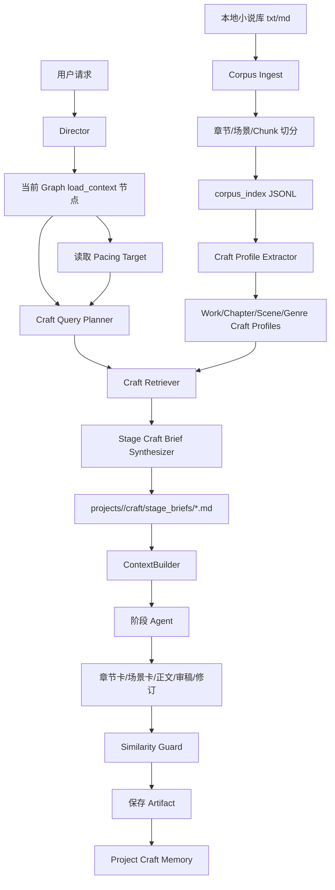

# AI Novelist「真实作者构思方法库」完整实现计划书

> 目标版本：Author Craft Layer v1.0  
> 目标项目：`hxfei-git/ai-novelist`  
> 日期：2026-05-23  
> 核心目标：让 AI Novelist 在大纲、章节规划、场景规划、正文写作、审稿、修订、定稿各阶段，能够参考本地小说库中真实作者的“构思方法”，而不是只依赖大模型凭空生成。  
> 核心边界：不复刻原文，不模仿具体作者表达，不搬运设定，只抽象叙事结构、冲突机制、人物弧线、场景推进、章节钩子、节奏控制和修订策略。

---

## 0. 当前仓库基线判断

当前项目已经具备接入 Author Craft Layer 的基础：

1. 主入口是 `chat`，由 Director Agent 调度 outline、worldbuilding、chapter planning、scene planning、drafting、review、revision、finalize、export 等工作流。
2. 当前已有阶段化写作流水线：
   - Outline Collaboration Graph
   - Chapter Planning Graph
   - Scene Planning Graph
   - Drafting Graph
   - Review Graph
   - Revision Graph
   - Finalize Graph
3. 当前已有 `ContextBuilder`，负责给不同阶段组装任务上下文。
4. 当前已有 `Artifact Registry`，可以保存并版本化阶段产物。
5. 当前已有 `state.json`，但不应继续塞入大文本。
6. 当前已有 research 搜索体系，支持本地轻量 RAG 和网络搜索，但它主要解决“参考资料/事实/同人资料检索”，不是“真实作者构思方法学习”。
7. 最新 `plan.md` 已经引入 Pacing Target / 章节节奏目标改造方向。Author Craft Layer 必须兼容 Pacing Target，不能再把每章都推向高冲突、高钩子、高转折。

因此，本计划不是另起一套写作系统，而是在现有流程中新增一个独立的“真实作者构思方法库”层：

```text
本地真实小说 txt/md
  -> Corpus Ingest
  -> Chunk / Chapter / Scene Index
  -> Craft Profile Extraction
  -> Craft Retrieval
  -> Stage Craft Brief
  -> ContextBuilder 注入
  -> 各阶段 Agent 使用
  -> Similarity Guard 防复刻
  -> Finalize 后沉淀 Project Craft Memory
```

---

## 1. 一句话结论

Author Craft Layer 要做的不是“把小说原文塞进 prompt”，而是：

> 把本地小说库中的真实作品，离线提炼成可检索、可解释、可控的“创作方法库”，并在每个创作阶段只注入当前阶段真正需要的构思方法。

例如：

```text
不要：
某本小说原文片段 -> 直接塞给 chapter_writer -> 模仿作者写法

要：
某本小说章节
  -> 分析：这一章如何开场、如何制造压力、如何延迟解释、如何软钩子收尾
  -> 保存：ChapterCraftProfile
  -> 当前项目写第 1 章时检索到该方法
  -> 注入：StageCraftBrief
  -> Agent 用这个方法生成当前项目自己的原创章节方案
```

---

## 2. 总体原则

### 2.1 数据边界

必须区分四类数据：

| 类型 | 内容 | 是否可进入最终 prompt | 是否可长期保存 |
|---|---|---:|---:|
| `RawText` | 本地小说原文 | 否 | 可以，只在本地索引中 |
| `RetrievalChunk` | 原文切块，带 offset 和 metadata | 否 | 可以，只在本地 JSONL |
| `CraftProfile` | 从原文抽象出的创作方法 | 可以 | 可以 |
| `StageCraftBrief` | 当前阶段可用的作者构思参考 | 可以 | 可以，作为项目 artifact |

第一版要求：

```text
StageCraftBrief 不携带长原文。
CraftEvidence 不保存长原文，只保存 source id、位置、分析摘要、标签。
所有创作 Agent 只能看到“方法”，不能看到可复刻的长段原文。
```

### 2.2 优先级

在所有 prompt 和 resolver 中明确优先级：

```text
用户明确要求
  > 锁定约束 locked_constraints
  > Novel Bible / 项目已定设定
  > Pacing Target / 节奏目标
  > 当前章节卡 / 场景卡 / 审稿任务
  > Project Craft Memory / 本项目已形成的方法
  > External Author Craft / 外部小说库构思参考
  > 大模型自由发挥
```

Author Craft 永远不能覆盖用户锁定约束、小说圣经和 Pacing Target。

### 2.3 与 Pacing Target 的关系

最新 `plan.md` 已经指出当前系统容易过度强化冲突、钩子和转折。Author Craft Layer 必须服务于 Pacing Target。

例如：

```text
如果当前章 function=aftermath, intensity=1, hook_strength=none：
  Author Craft 应检索“余波章、低压张力、情绪沉淀、软收束”方法。
  不应检索“强反转、强对抗、硬 cliffhanger”方法。

如果当前章 function=twist, intensity=4, hook_strength=hard：
  Author Craft 才可以检索“认知反转、信息重释、强钩子”方法。
```

StageCraftBrief 必须包含：

```text
## 与 Pacing Target 的对齐
- 本章功能：
- 目标强度：
- 本次采用的作者构思方法为何不破坏节奏目标：
- 本阶段禁止使用的方法：
```

### 2.4 第一版不做的事

第一版明确不做：

```text
不引入数据库。
不引入向量库。
不做 fine-tuning。
不做自动下载小说。
不在 prompt 中注入长原文。
不让模型模仿某个具体作者风格。
不把本地小说设定直接迁移到当前项目。
不要求一次性处理所有历史文件，先支持增量。
```

---

## 3. 最终目标架构



核心组件职责：

| 组件 | 职责 |
|---|---|
| `corpus/ingest.py` | 扫描本地小说文件，识别编码、元数据、文件指纹 |
| `corpus/chunker.py` | 按章节、场景、段落、长度切分 |
| `corpus/index.py` | 读写 `manifest.json`、`works.jsonl`、`chapters.jsonl`、`scenes.jsonl`、`chunks.jsonl` |
| `corpus/craft_schema.py` | 定义 Craft 数据结构 |
| `corpus/craft_extractor.py` | 从 chunk / chapter / scene 提炼创作方法 |
| `corpus/craft_query_planner.py` | 根据当前阶段、题材、Pacing Target 生成检索意图 |
| `corpus/craft_retriever.py` | 从 profiles 中检索适合当前阶段的方法 |
| `corpus/craft_brief.py` | 合成 StageCraftBrief |
| `corpus/craft_resolver.py` | 在图节点中统一生成并保存 brief |
| `corpus/similarity_guard.py` | 检测过度相似和原文复刻风险 |
| `corpus/project_memory.py` | 从已定稿章节沉淀本项目自己的 craft memory |
| `context_builder.py` | 只负责注入已生成的 craft brief，不负责检索和生成 |
| `artifacts.py` | 注册 craft 相关项目产物 |
| `state.py` | 只保存 craft 轻量状态，不保存大文本 |

---

## 4. 新增目录与文件

### 4.1 新增源码目录

```text
src/ai_novelist/corpus/
  __init__.py
  encoding.py
  models.py
  ingest.py
  chunker.py
  index.py
  craft_schema.py
  craft_extractor.py
  craft_query_planner.py
  craft_retriever.py
  craft_brief.py
  craft_resolver.py
  similarity_guard.py
  project_memory.py
  quality_report.py
  mock.py
```

说明：

```text
models.py              低层 corpus 数据结构：Work、Chapter、Scene、Chunk。
craft_schema.py        高层 craft 数据结构：CraftProfile、CraftEvidence、StageCraftBrief。
mock.py                mock extractor / mock resolver，保证测试不依赖真实模型。
quality_report.py      输出索引质量报告和异常文件报告。
```

### 4.2 新增 prompt

```text
src/ai_novelist/prompts/craft_profile_extractor.md
src/ai_novelist/prompts/stage_craft_brief_synthesizer.md
src/ai_novelist/prompts/project_craft_memory_extractor.md
src/ai_novelist/prompts/partials/author_craft_policy.md
```

如果当前 prompt loader 暂不支持 partial，第一版可以先在核心 prompt 中复制 policy，但最终目标是支持统一注入。

### 4.3 新增测试

```text
tests/fixtures/corpus/mock_novel_a.txt
tests/fixtures/corpus/mock_novel_b.txt
tests/fixtures/corpus/mock_novel_a.meta.json

tests/test_corpus_encoding.py
tests/test_corpus_ingest.py
tests/test_corpus_chunker.py
tests/test_corpus_index.py
tests/test_craft_schema.py
tests/test_craft_extractor_mock.py
tests/test_craft_query_planner.py
tests/test_craft_retriever.py
tests/test_craft_resolver.py
tests/test_craft_context_builder.py
tests/test_similarity_guard.py
tests/test_project_craft_memory.py
tests/test_cli_craft.py
tests/smoke_author_craft_mock.py
```

测试 fixture 必须是自造短篇，不使用真实版权文本。

---

## 5. 数据产物目录

### 5.1 全局 corpus index

默认路径：

```text
corpus_index/
  manifest.json
  works.jsonl
  chapters.jsonl
  scenes.jsonl
  chunks.jsonl
  craft_units.jsonl
  quality_report.md
  errors.jsonl
  pending_jobs.jsonl
  craft_profiles/
    works/
      <work_id>.json
    chapters/
      <work_id>.jsonl
    scenes/
      <work_id>.jsonl
    genres/
      <genre>.json
```

环境变量可覆盖：

```text
AI_NOVELIST_AUTHOR_CORPUS_DIR=/path/to/novels
AI_NOVELIST_CORPUS_INDEX_DIR=corpus_index
```

### 5.2 项目内 craft 产物

```text
projects/<project>/craft/
  stage_briefs/
    outline_stage_direction.md
    chapter_001_chapter_planning.md
    chapter_001_scene_design.md
    chapter_001_drafting.md
    chapter_001_review.md
    chapter_001_revision.md
  stage_sources/
    chapter_001_chapter_planning.sources.json
  project_craft_memory.json
  similarity_reports/
    chapter_001_draft_v1.json
    chapter_001_final.json
```

### 5.3 Artifact 类型

新增 artifact type：

```text
stage_craft_brief
stage_craft_sources
work_craft_profile
chapter_craft_profile
scene_craft_profile
genre_craft_profile
project_craft_memory
craft_similarity_report
craft_quality_report
```

---

## 6. 数据模型设计

### 6.1 Corpus 低层模型

建议放在 `src/ai_novelist/corpus/models.py`。

```python
from dataclasses import dataclass, field
from typing import Any

@dataclass(frozen=True)
class CorpusWork:
    work_id: str
    title: str
    author: str = ""
    genre: list[str] = field(default_factory=list)
    source_path: str = ""
    sha256: str = ""
    char_count: int = 0
    encoding: str = "utf-8"
    metadata: dict[str, Any] = field(default_factory=dict)

@dataclass(frozen=True)
class CorpusChapter:
    chapter_id: str
    work_id: str
    chapter_index: int
    title: str
    char_start: int
    char_end: int
    role_hint: str = ""  # opening/setup/escalation/midpoint/climax/aftermath/resolution

@dataclass(frozen=True)
class CorpusScene:
    scene_id: str
    work_id: str
    chapter_id: str
    scene_index: int
    char_start: int
    char_end: int
    position: str = ""  # scene_opening/scene_middle/scene_ending

@dataclass(frozen=True)
class RetrievalChunk:
    chunk_id: str
    work_id: str
    chapter_id: str
    scene_id: str
    chunk_index: int
    text: str
    char_start: int
    char_end: int
    chapter_index: int
    chapter_title: str
    position: str
    tags: list[str] = field(default_factory=list)
    metadata: dict[str, Any] = field(default_factory=dict)
```

### 6.2 Craft 高层模型

建议放在 `src/ai_novelist/corpus/craft_schema.py`。

```python
from dataclasses import dataclass, field
from typing import Any, Literal

CraftFacet = Literal[
    "premise",
    "conflict",
    "character_arc",
    "relationship",
    "scene_turn",
    "chapter_hook",
    "foreshadowing",
    "information_release",
    "pacing",
    "restraint",
    "narrative_distance",
    "dialogue",
    "atmosphere",
    "revision_strategy",
]

ProfileScope = Literal["work", "chapter", "scene", "genre", "project"]

@dataclass(frozen=True)
class CraftEvidence:
    source_id: str
    work_id: str
    chapter_id: str = ""
    scene_id: str = ""
    chunk_id: str = ""
    location_label: str = ""
    summary: str = ""
    # 第一版禁止保存长原文；quote 默认为空，最多允许短句，且不进入 StageCraftBrief
    short_quote: str = ""

@dataclass(frozen=True)
class CraftNote:
    note_id: str
    scope: ProfileScope
    facet: CraftFacet
    title: str
    pattern: str
    why_it_works: str
    use_when: list[str]
    avoid_when: list[str]
    pacing_functions: list[str]
    intensity_range: tuple[int, int] = (1, 5)
    evidence: list[CraftEvidence] = field(default_factory=list)
    tags: list[str] = field(default_factory=list)
    score: float = 0.0

@dataclass(frozen=True)
class CraftProfile:
    profile_id: str
    scope: ProfileScope
    work_id: str = ""
    title: str = ""
    author: str = ""
    genre: list[str] = field(default_factory=list)
    notes: list[CraftNote] = field(default_factory=list)
    metadata: dict[str, Any] = field(default_factory=dict)

@dataclass(frozen=True)
class CraftContext:
    purpose: str
    chapter: int | None
    stage: str
    query_terms: list[str]
    selected_notes: list[CraftNote]
    sources: list[CraftEvidence]
    max_chars: int

@dataclass(frozen=True)
class StageCraftBrief:
    project_id: str
    purpose: str
    chapter: int | None
    stage: str
    content: str
    source_profile_ids: list[str]
    source_note_ids: list[str]
    source_evidence: list[CraftEvidence]
    digest: str
    metadata: dict[str, Any] = field(default_factory=dict)
```

---

## 7. Phase 0：Author Craft Contract

### 7.1 目标

先定义系统边界，避免后续实现变成“本地小说模仿器”。

### 7.2 要做的改动

新增：

```text
docs/author_craft_contract.md
src/ai_novelist/prompts/partials/author_craft_policy.md
tests/test_author_craft_contract.py
```

`author_craft_policy.md` 内容必须包含：

```text
你可能会收到“作者构思参考”。这些内容来自本地小说库的结构化分析。

你应该：
- 学习真实作者的构思方法、结构策略、冲突组织、场景推进、信息释放、节奏控制和修订策略。
- 将其转化为当前项目自己的原创方案。
- 优先遵守用户要求、锁定约束、小说圣经、Pacing Target 和当前阶段产物。

你不能：
- 复刻本地小说原文。
- 模仿某个具体作者的独特表达。
- 搬运原作品人物、设定、情节。
- 输出与语料高度相似的连续段落。
- 为了贴近参考作品而覆盖本项目设定。
```

### 7.3 验收标准

```text
- docs/author_craft_contract.md 存在。
- author_craft_policy.md 存在。
- 测试能检查 policy 中包含“不复刻”“不模仿”“Pacing Target 优先”等关键短语。
```

---

## 8. Phase A：Corpus 基础设施

### 8.1 目标

把本地 `.txt/.md` 小说库稳定转换为 JSONL 索引。第一版不引入数据库、不引入向量库。

### 8.2 编码识别

新增 `encoding.py`：

```text
read_text_with_fallback(path: Path) -> tuple[str, str]
```

支持顺序：

```text
utf-8
utf-8-sig
gb18030
gbk
```

失败时写入 `errors.jsonl`，不要让整个索引流程崩溃。

### 8.3 文件扫描

新增 `ingest.py`：

```text
scan_corpus(corpus_dir: Path) -> list[CorpusFile]
```

规则：

```text
- 递归扫描 .txt/.md。
- 跳过隐藏目录、__MACOSX、.git、corpus_index、projects。
- 支持同名 .meta.json。
- 计算 sha256、size、mtime、char_count。
- 生成稳定 work_id。
```

`.meta.json` 示例：

```json
{
  "title": "示例小说A",
  "author": "mock_author",
  "genre": ["悬疑", "科幻"],
  "permission": "user_provided"
}
```

### 8.4 中文章节识别

新增 `chunker.py`：

```text
split_chapters(text: str) -> list[ChapterSpan]
split_scenes(chapter_text: str) -> list[SceneSpan]
chunk_scene(scene_text: str, target_chars=2400, overlap_chars=300) -> list[ChunkSpan]
```

章节正则：

```python
CHAPTER_PATTERNS = [
    r"^\s*第[一二三四五六七八九十百千万零〇两\d]+[章节回卷部].*$",
    r"^\s*(序章|楔子|引子|尾声|终章|番外.*).*$",
    r"^\s*Chapter\s+\d+.*$",
]
```

切块参数：

```text
target_chunk_chars = 2400
min_chunk_chars = 800
max_chunk_chars = 3600
overlap_chars = 300
```

切分优先级：

```text
章节标题
  -> 场景分隔符（***、——、时间/地点跳转）
  -> 空行
  -> 段落
  -> 固定长度硬切
```

### 8.5 双层切块

必须同时生成：

```text
chapters.jsonl      章节级分析单元
scenes.jsonl        场景级分析单元
chunks.jsonl        检索用 chunk
```

原因：

```text
RetrievalChunk 用于检索。
Chapter/Scene CraftUnit 用于提炼真实作者的构思方法。
```

### 8.6 Index 读写

新增 `index.py`：

```text
build_corpus_index(corpus_dir, index_dir, incremental=True) -> CorpusIndexResult
load_chunks(index_dir) -> Iterator[RetrievalChunk]
load_profiles(index_dir) -> Iterator[CraftProfile]
```

写入：

```text
manifest.json
works.jsonl
chapters.jsonl
scenes.jsonl
chunks.jsonl
quality_report.md
errors.jsonl
```

### 8.7 增量索引

`manifest.json` 记录：

```json
{
  "version": 1,
  "created_at": "...",
  "updated_at": "...",
  "corpus_dir": "/path/to/novels",
  "files": {
    "relative/path/a.txt": {
      "work_id": "work_xxx",
      "sha256": "...",
      "mtime": 123456789,
      "size": 10240000,
      "status": "indexed"
    }
  }
}
```

规则：

```text
sha256 未变：跳过。
sha256 变化：重建该 work 的 works/chapters/scenes/chunks/profile。
文件删除：清理对应 work 的索引记录。
```

### 8.8 验收标准

```text
.venv/bin/ai-novelist index-corpus --corpus-dir tests/fixtures/corpus --index-dir /tmp/corpus_index

必须生成：
- manifest.json
- works.jsonl
- chapters.jsonl
- scenes.jsonl
- chunks.jsonl
- quality_report.md

测试：
.venv/bin/python -m pytest tests/test_corpus_encoding.py tests/test_corpus_ingest.py tests/test_corpus_chunker.py tests/test_corpus_index.py
```

---

## 9. Phase B：Craft Profile 提炼

### 9.1 目标

从本地小说原文中提炼“创作方法”，而不是保存原文。

### 9.2 Profile 分层

必须实现四层 profile：

```text
WorkCraftProfile       一本小说整体结构方法
ChapterCraftProfile    每章开场、推进、转折、结尾方法
SceneCraftProfile      场景目标、阻碍、转折、退出状态
GenreCraftProfile      多作品聚合出的类型策略
```

第一版可以先实现 work/chapter/scene，genre aggregation 可在 Phase B 后半段完成。

### 9.3 提炼维度

Craft facet 至少包含：

```text
premise
conflict
character_arc
relationship
scene_turn
chapter_hook
foreshadowing
information_release
pacing
restraint
narrative_distance
dialogue
atmosphere
revision_strategy
```

每个 CraftNote 必须回答：

```text
- pattern：作者用了什么方法？
- why_it_works：为什么有效？
- use_when：适合什么时候使用？
- avoid_when：什么时候不能用？
- pacing_functions：适合哪些章节功能？
- intensity_range：适合强度范围？
- evidence：证据摘要，不含长原文。
```

### 9.4 Mock Extractor

`--mock` 下不调用真实模型，必须稳定输出。

新增：

```text
src/ai_novelist/corpus/mock.py
```

Mock 规则示例：

```text
- chapter_index == 1 -> opening / premise / hook notes
- scene_position == ending -> chapter_hook / scene_turn notes
- 出现“但是/然而/忽然/沉默/门/信/名单”等词 -> 生成对应标签
```

Mock 输出要稳定，不依赖随机数。

### 9.5 Real Extractor

真实模式使用现有 `AgentAdapter` 机制调用模型。

新增 prompt：

```text
src/ai_novelist/prompts/craft_profile_extractor.md
```

Prompt 要求：

```text
- 只输出 JSON。
- 不复述原文。
- 不模仿作者。
- 每条 note 最多 120 中文字。
- evidence.summary 是分析摘要，不是原文。
- short_quote 默认空；如必须使用，不超过 30 中文字，且不进入 StageCraftBrief。
```

### 9.6 输出文件

```text
corpus_index/craft_profiles/works/<work_id>.json
corpus_index/craft_profiles/chapters/<work_id>.jsonl
corpus_index/craft_profiles/scenes/<work_id>.jsonl
corpus_index/craft_profiles/genres/<genre>.json
```

### 9.7 验收标准

```text
.venv/bin/ai-novelist extract-craft --index-dir /tmp/corpus_index --mock

必须生成：
- craft_profiles/works/*.json
- craft_profiles/chapters/*.jsonl
- craft_profiles/scenes/*.jsonl

测试：
.venv/bin/python -m pytest tests/test_craft_schema.py tests/test_craft_extractor_mock.py
```

---

## 10. Phase C：阶段化检索与 Query Planner

### 10.1 目标

根据当前创作阶段、当前题材、Pacing Target、章节位置、当前项目状态，检索最相关的作者构思方法。

### 10.2 Purpose -> Facet 映射

新增 `craft_query_planner.py`。

基础映射：

```python
PURPOSE_TO_FACETS = {
    "outline_stage": [
        "premise",
        "conflict",
        "character_arc",
        "information_release",
        "pacing",
    ],
    "chapter_planning": [
        "chapter_hook",
        "conflict",
        "character_arc",
        "information_release",
        "pacing",
        "restraint",
    ],
    "scene_design": [
        "scene_turn",
        "conflict",
        "relationship",
        "information_release",
        "atmosphere",
    ],
    "drafting": [
        "narrative_distance",
        "dialogue",
        "atmosphere",
        "information_release",
        "pacing",
    ],
    "review": [
        "conflict",
        "character_arc",
        "chapter_hook",
        "pacing",
        "restraint",
    ],
    "revision": [
        "revision_strategy",
        "character_arc",
        "information_release",
        "foreshadowing",
        "pacing",
    ],
}
```

### 10.3 Pacing Target 对检索的影响

新增：

```text
plan_craft_query(state, store, purpose, chapter, stage, pacing_target) -> CraftQuery
```

如果 `pacing_target` 存在：

```text
function=breather/aftermath/setup:
  boost facets: restraint, atmosphere, relationship, emotional pacing
  suppress facets: hard_hook, major_reveal, external_conflict

function=twist/climax:
  boost facets: chapter_hook, reveal, conflict, information_release
  suppress facets: over-exposition

intensity <= 2:
  只允许检索 intensity_range 覆盖 1-2 的 notes

intensity >= 4:
  可以检索 high-intensity notes，但仍必须遵守 reveal_quota
```

如果 Pacing Target 尚未实现，则使用中性默认值：

```json
{
  "function": "unknown",
  "intensity": 3,
  "hook_strength": "medium",
  "conflict_mode": "mixed"
}
```

### 10.4 Retriever

新增 `craft_retriever.py`：

```text
retrieve_craft_context(index_dir, query, max_notes=8) -> CraftContext
```

第一版检索策略：

```text
score =
  facet_match * 3
  + genre_match * 2
  + stage_match * 2
  + pacing_function_match * 2
  + intensity_match * 2
  + keyword_match
  + diversity_bonus
```

不要引入向量库。中文关键词可先用字符 bigram + 简单词表。

### 10.5 Source Diversity

同一次 StageCraftBrief 中：

```text
- 同一本作品最多 3 条 note。
- 同一章节最多 2 条 note。
- 至少优先混合 work/chapter/scene 三种 scope。
- 如果 Project Craft Memory 存在，优先插入 1-3 条本项目 notes。
```

### 10.6 验收标准

```text
- chapter_planning 检索不到 drafting-only notes。
- breather/aftermath 不检索 hard hook 作为主建议。
- craft_mode=off 时不检索。
- 查询结果不包含 raw text。
```

测试：

```text
.venv/bin/python -m pytest tests/test_craft_query_planner.py tests/test_craft_retriever.py
```

---

## 11. Phase D：Stage Craft Brief 合成

### 11.1 目标

把检索到的 CraftNotes 合成为当前阶段能直接注入 prompt 的 Markdown 简报。

### 11.2 新增 `craft_brief.py`

```text
build_stage_craft_brief(context: CraftContext, pacing_target: dict | None, max_chars: int) -> StageCraftBrief
```

### 11.3 StageCraftBrief 模板

```markdown
# 作者构思参考

## 使用规则
- 只学习构思方法，不复刻原文。
- 只学习结构策略，不模仿具体作者表达。
- 当前项目的锁定约束、小说圣经、Pacing Target 优先级更高。
- 如果参考方法与本章节奏目标冲突，必须放弃该参考方法。

## 当前阶段
- purpose:
- chapter:
- stage:
- craft_mode:

## 与 Pacing Target 的对齐
- 本章功能：
- 目标强度：
- 钩子强度：
- 冲突模式：
- 本次可用方法：
- 本次禁止方法：

## 可采用的真实作者构思方法
1. 方法名：
   - 方法：
   - 为什么有效：
   - 适用条件：
   - 当前项目可如何转化：
   - 避免事项：

## 本阶段应用建议
- 对当前任务的 3-6 条具体建议。

## 不应采纳的方向
- 与 Pacing Target 或当前项目设定冲突的方向。

## 来源摘要
- work_id / profile_id / note_id / location_label / summary
```

### 11.4 字符限制

配置：

```text
AI_NOVELIST_CRAFT_MAX_CHARS=3000
```

规则：

```text
- 默认最多 3000 字符。
- strict 模式最多 4500。
- assist 模式最多 3000。
- review/revision 可到 4000。
- 超限时优先保留 Pacing 对齐、应用建议、禁止方向。
```

### 11.5 验收标准

```text
- StageCraftBrief 不含长原文。
- 生成内容包含“使用规则”“与 Pacing Target 的对齐”“可采用方法”“不应采纳方向”。
- max_chars 生效。
- source ids 写入 sources.json。
```

测试：

```text
.venv/bin/python -m pytest tests/test_craft_resolver.py
```

---

## 12. Phase E：AuthorCraftResolver 接入

### 12.1 目标

不要让 `ContextBuilder` 负责检索和生成，只让它注入。新增 Resolver 在各 graph 的 load_context 节点中执行。

### 12.2 新增 `craft_resolver.py`

```python
def resolve_author_craft(
    state: NovelState,
    store: LocalStore,
    purpose: str,
    chapter: int | None = None,
    stage: str | None = None,
    adapter: AgentAdapter | None = None,
    max_chars: int | None = None,
) -> NovelState:
    ...
```

职责：

```text
1. 检查 craft_mode。
2. 读取 corpus_index。
3. 读取 Pacing Target。
4. 生成 CraftQuery。
5. 检索 CraftContext。
6. 合成 StageCraftBrief。
7. 保存 projects/<project>/craft/stage_briefs/*.md。
8. 保存 projects/<project>/craft/stage_sources/*.json。
9. 注册 artifact。
10. 更新 state 中的轻量字段。
```

### 12.3 Graph 接入点

#### 12.3.1 Chapter Planning

在 `graph_chapter_plan.py` 的 `load_chapter_context_node` 中：

```text
当前：
context = build_context(state, store, "chapter_planning", chapter=state.active_chapter, max_chars=14000)

改为：
state = resolve_author_craft(state, store, "chapter_planning", chapter=state.active_chapter)
context = build_context(state, store, "chapter_planning", chapter=state.active_chapter, max_chars=14000)
```

#### 12.3.2 Scene Design

在 `graph_scene.py` 构建 `scene_design_context` 前：

```text
state = resolve_author_craft(state, store, "scene_design", chapter=state.active_chapter)
context = build_context(state, store, "scene_design", chapter=state.active_chapter, max_chars=14000)
```

#### 12.3.3 Drafting

在 `graph_drafting.py` 构建 `drafting_context` 前：

```text
state = resolve_author_craft(state, store, "drafting", chapter=state.active_chapter)
context = build_context(state, store, "drafting", chapter=state.active_chapter, max_chars=18000)
```

#### 12.3.4 Review

在 `graph_review.py` 构建 `review_context` 前：

```text
state = resolve_author_craft(state, store, "review", chapter=state.active_chapter)
context = build_context(state, store, "review", chapter=state.active_chapter, max_chars=18000)
```

#### 12.3.5 Revision

在 `graph_revision.py` 构建 `revision_context` 前：

```text
state = resolve_author_craft(state, store, "revision", chapter=state.active_chapter)
context = build_context(state, store, "revision", chapter=state.active_chapter, max_chars=18000)
```

#### 12.3.6 Outline Stage

如果 outline graph 当前使用 `build_context(..., "outline_stage")`，在各 stage agent 前调用：

```text
state = resolve_author_craft(state, store, "outline_stage", stage=state.outline_stage)
```

第一版可以先覆盖：

```text
chapter_planning
scene_design
drafting
review
revision
```

outline_stage 可作为 Phase E 后半段。

### 12.4 验收标准

```text
- 执行 plan_chapter 时生成 chapter_001_chapter_planning.md。
- 执行 plan_scenes 时生成 chapter_001_scene_design.md。
- 执行 write_chapter 时生成 chapter_001_drafting.md。
- craft_mode=off 不生成 brief。
- Resolver 失败不应中断主写作流程，应降级为“不注入作者构思参考”，并在 state.error 或 debug report 记录轻量警告。
```

---

## 13. Phase F：ContextBuilder 注入

### 13.1 目标

`ContextBuilder` 在上下文中加入“作者构思参考”小节。

### 13.2 修改 `context_builder.py`

新增 profile section key：

```text
author_craft
```

新增函数：

```python
def build_author_craft_section(state: NovelState, store: LocalStore, mode: str = "brief") -> str:
    ...
```

读取优先级：

```text
1. state.active_craft_brief_path 指向的 artifact 文件
2. get_latest_artifact(project_dir, "stage_craft_brief", chapter=chapter, stage=purpose/stage)
3. state.craft_context_digest
4. 暂无
```

### 13.3 注入位置

在所有创作类 profile 中，放在：

```text
锁定约束之后
小说圣经 / chapter artifacts 之前
```

例如：

```python
"chapter_planning": ContextProfile(
    sections=(
        "user_request",
        "task",
        "locked_constraints",
        "author_craft",
        "chapter_outline_slice",
        "previous_chapter_summaries",
        "bible_digest",
    ),
)
```

需要修改的 profiles：

```text
director：可选，第一版不强制
outline_role
outline_synthesizer
chapter_planning
review_context
review_editor
review_synthesizer
revision
fallback build_context
```

如果当前没有 `scene_design` / `drafting` / `review` 明确 profile，要添加 profile，避免 fallback 上下文过大和不可控。

### 13.4 验收标准

```text
- build_context(..., "chapter_planning") 中出现“作者构思参考”。
- “作者构思参考”位于“锁定约束”之后。
- craft_mode=off 时不出现该小节或显示“暂无”。
- 不影响原有 section。
```

测试：

```text
.venv/bin/python -m pytest tests/test_craft_context_builder.py
```

---

## 14. Phase G：State、Artifact、Storage

### 14.1 修改 `state.py`

新增轻量字段：

```python
craft_mode: str = "off"  # off / assist / strict
active_craft_brief_path: str = ""
craft_profile_ids: list[str] = field(default_factory=list)
craft_sources: list[dict[str, Any]] = field(default_factory=list)
craft_context_digest: str = ""
craft_updated_at: str = ""
project_craft_memory_path: str = ""
craft_options: dict[str, Any] = field(default_factory=dict)
```

`from_dict()` 必须兼容旧 state。

### 14.2 State 禁止保存

不要在 state 中保存：

```text
- raw text
- RetrievalChunk.text
- 完整 StageCraftBrief
- 大量 evidence
- 大量 profiles
```

### 14.3 Artifact Registry

`artifacts.py` 不需要强制改数据结构，但要在调用处注册新类型：

```text
stage_craft_brief
stage_craft_sources
project_craft_memory
craft_similarity_report
```

如果需要，可以新增 helper：

```python
def save_craft_markdown_artifact(...)
def save_craft_json_artifact(...)
```

但不要破坏现有 `save_markdown_artifact` / `save_json_artifact`。

### 14.4 LocalStore

如果 `LocalStore` 已有 path helper，可新增：

```python
def craft_dir(project_id: str) -> Path
def stage_craft_brief_path(project_id: str, purpose: str, chapter: int | None, stage: str | None) -> Path
def stage_craft_sources_path(...)
def project_craft_memory_path(project_id: str) -> Path
```

如果不想改 `LocalStore`，resolver 也可以用 `store.project_dir(project_id) / "craft"`。

### 14.5 验收标准

```text
- 旧 state.json 能正常加载。
- 新 state 保存后包含 craft 轻量字段。
- artifacts.json 中能看到 stage_craft_brief 记录。
```

---

## 15. Phase H：CLI 与配置

### 15.1 修改 `config.py`

新增 Settings 字段：

```python
author_corpus_dir: str = ""
corpus_index_dir: str = "corpus_index"
craft_mode: str = "off"
craft_max_chars: int = 3000
craft_similarity_guard: bool = True
craft_extract_mock: bool = False
```

新增环境变量：

```text
AI_NOVELIST_AUTHOR_CORPUS_DIR
AI_NOVELIST_CORPUS_INDEX_DIR
AI_NOVELIST_CRAFT_MODE
AI_NOVELIST_CRAFT_MAX_CHARS
AI_NOVELIST_CRAFT_SIMILARITY_GUARD
AI_NOVELIST_CRAFT_EXTRACT_MOCK
```

注意：保留现有 `AI_NOVELIST_LOCAL_CORPUS_DIR` 和 `--local-corpus-dir`，不破坏 research 流程。

### 15.2 新增 CLI 命令

```bash
ai-novelist index-corpus \
  --corpus-dir /path/to/novels \
  --index-dir corpus_index

ai-novelist extract-craft \
  --index-dir corpus_index \
  --mock

ai-novelist craft-status \
  --project demo \
  --index-dir corpus_index

ai-novelist craft-profiles \
  --index-dir corpus_index \
  --limit 20

ai-novelist craft-brief \
  --project demo \
  --purpose chapter_planning \
  --chapter 1 \
  --index-dir corpus_index \
  --craft-mode assist

ai-novelist craft-similarity-check \
  --project demo \
  --chapter 1 \
  --draft projects/demo/chapters/chapter_001/draft_v1.md \
  --index-dir corpus_index
```

### 15.3 扩展现有命令参数

给这些命令添加：

```text
chat
feishu
compose
write-chapter
review
finalize-chapter 可选
```

参数：

```text
--author-corpus-dir
--corpus-index-dir
--craft-mode off|assist|strict
--craft-max-chars
--craft-profile
--craft-genre
--craft-exclude-work
```

第一版至少给 `chat` 和 `feishu` 增加：

```text
--author-corpus-dir
--corpus-index-dir
--craft-mode
```

### 15.4 craft_mode 语义

```text
off：
  完全不使用 Author Craft Layer。

assist：
  注入简短 StageCraftBrief，作为参考，不强制。

strict：
  注入更完整 brief，并要求 synthesizer 解释采用/拒绝哪些方法。
  仍然不得覆盖锁定约束、Novel Bible、Pacing Target。
```

### 15.5 验收标准

```text
.venv/bin/ai-novelist --help 能看到新命令。
.venv/bin/ai-novelist chat --help 能看到 --author-corpus-dir / --craft-mode。
--local-corpus-dir 仍然存在且语义不变。
```

测试：

```text
.venv/bin/python -m pytest tests/test_cli_craft.py
```

---

## 16. Phase I：Prompt Policy 统一接入

### 16.1 目标

所有创作类 prompt 明确如何使用作者构思参考。

### 16.2 核心规则

在以下 prompt 中加入或自动注入 `author_craft_policy.md`：

```text
director.md
direction_proposer.md
outline_planner.md
world_builder.md
chapter_goal_agent.md
chapter_conflict_agent.md
chapter_hook_agent.md
chapter_card_synthesizer.md
scene_breakdown_agent.md
scene_conflict_check_agent.md
scene_synthesizer.md
chapter_writer.md
dialogue_enhancer.md
atmosphere_enhancer.md
hook_enhancer.md
style_normalizer.md
continuity_editor.md
structure_editor.md
character_arc_editor.md
style_editor.md
simulated_reader.md
review_synthesizer.md
revision_planner.md
targeted_reviser.md
revision_self_check.md
```

如果 prompt 文件名和当前仓库不完全一致，Codex 应以实际 `src/ai_novelist/prompts/` 目录为准。

### 16.3 Synthesizer 特别规则

对 synthesizer 类 prompt 增加：

```text
你不是会议纪要员，而是主编。
不要机械合并所有 Author Craft 建议。
只采纳符合当前项目、锁定约束、Novel Bible、Pacing Target 的方法。
必须区分：
- adopted_craft_methods
- rejected_craft_methods
- deferred_craft_methods
```

### 16.4 Review / Revision 特别规则

Review：

```text
审稿时判断当前输出是否正确使用了作者构思参考。
如果输出为了追求真实作者感而破坏 Pacing Target，应指出。
如果输出与本地语料过度相似，应标记 originality_risk。
```

Revision：

```text
修订只能执行不破坏 Pacing Target、不复刻本地语料的方法。
对 originality_risk 必须做原创化重写。
```

### 16.5 验收标准

```text
- 核心 prompt 中包含“不复刻原文、不模仿具体作者表达、Pacing Target 优先”。
- Synthesizer 能输出采纳/拒绝/延后。
```

---

## 17. Phase J：Similarity Guard 防复刻

### 17.1 目标

不能只靠 prompt 防复刻。必须做后置检查。

### 17.2 新增 `similarity_guard.py`

第一版实现：

```text
1. normalize_text(text)
2. char_ngrams(text, n=8)
3. longest_common_substring(a, b, max_scan_chars)
4. overlap_score(generated, source_chunk)
5. check_similarity(generated, candidate_chunks) -> SimilarityReport
```

不要对全库所有 chunks 暴力比对。候选来源：

```text
- 本次 StageCraftBrief 使用过的 source chunks。
- 检索得分最高的前 N 个 chunks。
- 同一 work/chapter 的相邻 chunks。
```

### 17.3 阈值建议

```text
longest_common_substring > 120 中文字符：高风险
8-gram overlap > 0.22：中高风险
连续相似句式多处出现：中风险
```

第一版阈值可配置：

```text
AI_NOVELIST_CRAFT_MAX_COMMON_SUBSTRING=120
AI_NOVELIST_CRAFT_NGRAM_OVERLAP_THRESHOLD=0.22
```

### 17.4 接入点

第一版只在保存正文后运行：

```text
drafting save_draft 后
revision save_revised_draft 后
finalize save_final_chapter 前或后
```

如果高风险：

```text
assist 模式：记录报告 + review 中提示 originality_risk。
strict 模式：设置 review_status=revision_requested 或追加修订任务。
```

### 17.5 输出

```text
projects/<project>/craft/similarity_reports/chapter_001_draft_v1.json
```

报告结构：

```json
{
  "project_id": "demo",
  "chapter": 1,
  "artifact": "draft_v1",
  "risk": "low|medium|high",
  "max_common_substring": 0,
  "max_ngram_overlap": 0.0,
  "matched_sources": [
    {
      "chunk_id": "...",
      "work_id": "...",
      "score": 0.0,
      "reason": "..."
    }
  ],
  "recommendations": []
}
```

### 17.6 验收标准

```text
- 明显复制 fixture 原文时能判 high risk。
- 原创文本时 low risk。
- 报告注册为 craft_similarity_report artifact。
```

测试：

```text
.venv/bin/python -m pytest tests/test_similarity_guard.py
```

---

## 18. Phase K：Project Craft Memory

### 18.1 目标

系统不应永远只学外部小说库，也要学习当前项目已经定稿的章节，从而保持长篇写作的一致性。

### 18.2 新增 `project_memory.py`

```text
extract_project_craft_memory(state, store, chapter, adapter=None) -> ProjectCraftMemory
load_project_craft_memory(project_id) -> CraftProfile
```

定稿后，从以下材料提炼：

```text
final.md
summary.md
review_v*.json
revision_plan_v*.md
Novel Bible
Pacing Target 实际达成情况
```

提炼内容：

```text
- 本项目已确立的章节开法
- 本项目已确立的场景节奏
- 主角内心推进方式
- 对白边界
- 信息释放边界
- 本项目禁用套路
- 容易偏离的风险
```

### 18.3 接入点

在 `finalize_chapter` 流程中：

```text
save_final_chapter
summarize_chapter
extract_bible_updates_from_final
update_bible
extract_project_craft_memory
```

如果不想改 finalize graph 的顺序，第一版可在 finalize 结束后调用。

### 18.4 Project Memory 优先级

在 `craft_retriever` 中：

```text
Project Craft Memory notes 优先级高于外部 Author Craft notes。
每次 StageCraftBrief 至少尝试注入 1 条 project note。
```

### 18.5 验收标准

```text
- 定稿第 1 章后生成 projects/<project>/craft/project_craft_memory.json。
- 写第 2 章时 StageCraftBrief 中出现“本项目已确立方法”。
```

测试：

```text
.venv/bin/python -m pytest tests/test_project_craft_memory.py
```

---

## 19. Phase L：效果评测与回归

### 19.1 目标

证明 Author Craft Layer 真的有用，而不是只是多塞了一段上下文。

### 19.2 新增 eval cases

```text
tests/evals/author_craft_cases.jsonl
```

每行：

```json
{
  "case_id": "chapter_opening_identity_crisis",
  "purpose": "chapter_planning",
  "genre": ["悬疑", "科幻"],
  "chapter": 1,
  "pacing_target": {
    "function": "setup",
    "intensity": 2,
    "hook_strength": "soft"
  },
  "user_request": "月球城市失忆工程师醒来后发现自己可能参与事故",
  "expected_facets": ["premise", "information_release", "pacing", "chapter_hook"],
  "forbidden_facets": ["hard_cliffhanger", "major_reveal"],
  "forbidden_phrases": ["模仿", "照着", "复刻"]
}
```

### 19.3 自动检查

```text
- StageCraftBrief 是否包含 expected_facets。
- 是否没有 forbidden_facets。
- 是否没有长原文。
- 是否没有“模仿某作者”的措辞。
- 是否遵守 max_chars。
- craft_mode=off 时是否不注入。
- Pacing Target 低强度时是否不建议强钩子。
```

### 19.4 人工评分维度

为真实模型输出留人工评估表：

```text
1. 真实作者构思感：1-5
2. 原创性：1-5
3. 阶段相关性：1-5
4. Pacing Target 对齐：1-5
5. 冲突质量：1-5
6. 人物动机质量：1-5
7. 信息释放质量：1-5
8. 是否有复刻风险：low/medium/high
```

### 19.5 验收标准

```text
.venv/bin/python tests/smoke_author_craft_mock.py

必须完成：
- index-corpus
- extract-craft --mock
- craft-brief
- chat --mock --craft-mode assist
- pytest 全通过
```

---

## 20. Phase M：文档与用户体验

### 20.1 README 更新

新增章节：

```text
## 真实作者构思方法库 Author Craft Layer
```

包含：

```bash
export AI_NOVELIST_AUTHOR_CORPUS_DIR=/path/to/novels
export AI_NOVELIST_CORPUS_INDEX_DIR=corpus_index
export AI_NOVELIST_CRAFT_MODE=assist

.venv/bin/ai-novelist index-corpus --corpus-dir "$AI_NOVELIST_AUTHOR_CORPUS_DIR"
.venv/bin/ai-novelist extract-craft --index-dir "$AI_NOVELIST_CORPUS_INDEX_DIR" --mock
.venv/bin/ai-novelist chat --project demo --mock --craft-mode assist
```

### 20.2 docs 新增

```text
docs/author_craft_layer.md
docs/author_craft_contract.md
docs/corpus_format.md
docs/craft_eval.md
```

### 20.3 用户命令说明

在 chat 中逐步支持自然语言：

```text
开启作者构思参考
关闭作者构思参考
查看本章作者构思参考
本章不要使用本地小说库
只参考悬疑类作品
不要参考某本作品
```

第一版可以只支持 CLI，不必马上支持自然语言 Director intent。

---

## 21. Phase N：性能与成本控制

### 21.1 成本原则

```text
- Runtime 阶段只读 profiles，不临时分析原文。
- 原文分析只在 index/extract 阶段做。
- 文件未变化不重建。
- profiles 已存在且 hash 未变不重提炼。
```

### 21.2 批处理

`extract-craft` 支持：

```text
--limit-files
--limit-chunks
--work-id
--resume
--dry-run
--mock
```

`--dry-run` 输出：

```text
- 将处理多少 work
- 将处理多少 chapter
- 将处理多少 scene
- 预计 profile 数
- 预计调用模型次数
```

### 21.3 失败恢复

写入：

```text
pending_jobs.jsonl
errors.jsonl
```

失败不影响已完成 profile。

### 21.4 验收标准

```text
- 重复运行 index-corpus 时未变化文件被跳过。
- extract-craft 中断后可以 resume。
- --dry-run 不写 profile。
```

---

## 22. 端到端执行脚本

新增：

```text
tests/smoke_author_craft_mock.py
```

内容应覆盖：

```python
def test_author_craft_mock_flow(tmp_path):
    # 1. 创建 mock corpus
    # 2. index-corpus
    # 3. extract-craft --mock
    # 4. 创建项目
    # 5. craft-brief chapter_planning
    # 6. chat/write-chapter --mock --craft-mode assist
    # 7. 断言 stage_craft_brief artifact 存在
    # 8. 断言 ContextBuilder 中有“作者构思参考”
    # 9. 断言 brief 不含长原文
```

CLI 手工验收命令：

```bash
.venv/bin/python -m pytest

.venv/bin/ai-novelist index-corpus \
  --corpus-dir tests/fixtures/corpus \
  --index-dir /tmp/ai_novelist_corpus_index

.venv/bin/ai-novelist extract-craft \
  --index-dir /tmp/ai_novelist_corpus_index \
  --mock

.venv/bin/ai-novelist craft-brief \
  --project craft-demo \
  --purpose chapter_planning \
  --chapter 1 \
  --index-dir /tmp/ai_novelist_corpus_index \
  --craft-mode assist \
  --mock

.venv/bin/ai-novelist chat \
  --project craft-demo \
  --mock \
  --corpus-index-dir /tmp/ai_novelist_corpus_index \
  --craft-mode assist
```

---

## 23. Codex CLI 推荐迭代顺序

### 23.1 总体执行原则

每次交给 Codex CLI 只做一个 phase，避免一次性大改。

推荐每个 phase 的固定提示：

```text
你正在实现 AI Novelist 的 Author Craft Layer。请只实现 Phase X，不要提前实现后续 phase。
必须保持现有测试通过。
不得破坏现有 --local-corpus-dir research 流程。
不得引入数据库或向量库。
mock 模式必须稳定，不依赖真实模型。
实现后运行相关 pytest，并修复失败。
```

### 23.2 迭代 1：Phase 0 + Phase A 最小版

交给 Codex：

```text
实现 Author Craft Layer Phase 0 和 Phase A 最小版：
- 新增 docs/author_craft_contract.md
- 新增 prompts/partials/author_craft_policy.md
- 新增 src/ai_novelist/corpus/encoding.py / models.py / ingest.py / chunker.py / index.py
- 新增 index-corpus CLI
- 生成 manifest.json / works.jsonl / chapters.jsonl / scenes.jsonl / chunks.jsonl / quality_report.md
- 新增 tests/test_corpus_encoding.py / test_corpus_ingest.py / test_corpus_chunker.py / test_corpus_index.py
- 不引入数据库，不引入向量库
- 不改现有 research 的 --local-corpus-dir 语义
```

验收：

```bash
.venv/bin/python -m pytest tests/test_corpus_encoding.py tests/test_corpus_ingest.py tests/test_corpus_chunker.py tests/test_corpus_index.py
```

### 23.3 迭代 2：Phase B Mock Craft Profile

交给 Codex：

```text
实现 Phase B 的 mock craft profile 提炼：
- 新增 craft_schema.py / craft_extractor.py / mock.py
- 新增 craft_profile_extractor.md
- 新增 extract-craft CLI，支持 --mock
- 从 chunks/chapters/scenes 中生成 work/chapter/scene profiles
- 输出 craft_profiles/works/*.json、chapters/*.jsonl、scenes/*.jsonl
- 不调用真实模型
- 不保存长原文到 profile
```

验收：

```bash
.venv/bin/python -m pytest tests/test_craft_schema.py tests/test_craft_extractor_mock.py
```

### 23.4 迭代 3：Phase C + D 检索和 Brief

交给 Codex：

```text
实现 Phase C 和 Phase D：
- 新增 craft_query_planner.py / craft_retriever.py / craft_brief.py
- 新增 craft-brief CLI
- 根据 purpose 和可选 pacing_target 检索 notes
- 生成 StageCraftBrief Markdown 和 sources JSON
- brief 必须包含使用规则、Pacing Target 对齐、可采用方法、不应采纳方向、来源摘要
- 不输出长原文
```

验收：

```bash
.venv/bin/python -m pytest tests/test_craft_query_planner.py tests/test_craft_retriever.py tests/test_craft_resolver.py
```

### 23.5 迭代 4：Phase E + F 接入 ContextBuilder

交给 Codex：

```text
实现 AuthorCraftResolver 和 ContextBuilder 注入：
- 新增 craft_resolver.py
- 修改 state.py 添加 craft 轻量字段并兼容旧 state
- 修改 context_builder.py 添加 author_craft section
- 在 chapter_plan/scene/drafting/review/revision 的 load_context 节点前调用 resolver
- craft_mode=off 时完全不注入
- resolver 失败时降级，不中断主工作流
```

验收：

```bash
.venv/bin/python -m pytest tests/test_craft_context_builder.py tests/test_craft_resolver.py
.venv/bin/python -m pytest
```

### 23.6 迭代 5：Phase H CLI + Prompt Policy

交给 Codex：

```text
实现 CLI/config/prompt policy：
- config.py 新增 Author Craft 设置
- chat/feishu 增加 --author-corpus-dir、--corpus-index-dir、--craft-mode、--craft-max-chars
- 新增 craft-status / craft-profiles
- 核心创作 prompt 加入 author_craft_policy
- 不破坏现有 CLI
```

验收：

```bash
.venv/bin/ai-novelist --help
.venv/bin/ai-novelist chat --help
.venv/bin/python -m pytest tests/test_cli_craft.py
```

### 23.7 迭代 6：Phase J Similarity Guard

交给 Codex：

```text
实现 Similarity Guard：
- 新增 similarity_guard.py
- 支持 ngram overlap 和 longest common substring
- 在 drafting/revision/finalize 保存后生成 similarity_report
- high risk 在 strict 模式进入 revision_requested
- assist 模式只记录 report
```

验收：

```bash
.venv/bin/python -m pytest tests/test_similarity_guard.py
```

### 23.8 迭代 7：Phase K Project Craft Memory

交给 Codex：

```text
实现 Project Craft Memory：
- 新增 project_memory.py
- finalize 后从 final chapter / summary / review report 提炼项目自身 craft notes
- 保存 projects/<project>/craft/project_craft_memory.json
- retriever 优先使用 project memory
```

验收：

```bash
.venv/bin/python -m pytest tests/test_project_craft_memory.py
```

### 23.9 迭代 8：Phase L/M/N 完整闭环

交给 Codex：

```text
实现 Author Craft Layer 端到端验收：
- 新增 tests/evals/author_craft_cases.jsonl
- 新增 tests/smoke_author_craft_mock.py
- README 和 docs 更新
- dry-run/resume/quality report 完善
- 确保 .venv/bin/python -m pytest 全通过
```

验收：

```bash
.venv/bin/python -m pytest
.venv/bin/python tests/smoke_author_craft_mock.py
```

---

## 24. 关键验收清单

最终完成后，应满足：

```text
[ ] 可以索引 tests/fixtures/corpus/*.txt。
[ ] 可以处理单本 10MB 中文小说。
[ ] 可以增量跳过未变化文件。
[ ] 可以生成 work/chapter/scene craft profiles。
[ ] mock 模式不调用真实模型。
[ ] chat --craft-mode off 不注入作者构思参考。
[ ] chat --craft-mode assist 注入 StageCraftBrief。
[ ] StageCraftBrief 不含长原文。
[ ] StageCraftBrief 与 Pacing Target 对齐。
[ ] Chapter Planning 能使用作者构思方法生成更真实的章节卡。
[ ] Scene Design 能使用场景推进方法。
[ ] Drafting 能使用叙述距离、对白、氛围、信息释放方法。
[ ] Review 能检查是否滥用或误用作者构思参考。
[ ] Revision 能执行原创化修订。
[ ] Similarity Guard 能发现明显复刻。
[ ] Finalize 后能沉淀 Project Craft Memory。
[ ] Project Craft Memory 在后续章节优先于外部 craft。
[ ] artifacts.json 记录 stage_craft_brief / similarity_report / project_craft_memory。
[ ] state.json 不保存原文或大文本。
[ ] 现有 --local-corpus-dir research 流程不受影响。
[ ] .venv/bin/python -m pytest 通过。
```

---

## 25. 风险与规避

### 25.1 复刻风险

风险：

```text
模型看到过多原文后，可能复刻句式或桥段。
```

规避：

```text
- StageCraftBrief 不注入长原文。
- Evidence 只保存摘要和 source id。
- Similarity Guard 后置检查。
- Prompt policy 明确禁止复刻。
```

### 25.2 过度套路化

风险：

```text
CraftProfile 全是“冲突升级、结尾钩子”，导致每章更套路。
```

规避：

```text
- Query Planner 必须使用 Pacing Target。
- 低强度章节 boost restraint / atmosphere / relationship。
- Synthesizer 必须输出 rejected/deferred methods。
```

### 25.3 Context 过载

风险：

```text
每阶段塞太多 craft，影响主任务。
```

规避：

```text
- 默认 craft_max_chars=3000。
- 每次最多 6-8 条 CraftNote。
- Project Craft Memory 优先，外部 craft 精简。
```

### 25.4 与 Research 混淆

风险：

```text
AI_NOVELIST_LOCAL_CORPUS_DIR 和 AI_NOVELIST_AUTHOR_CORPUS_DIR 职责混乱。
```

规避：

```text
- local-corpus-dir 继续用于 research 检索资料。
- author-corpus-dir 专用于 Author Craft Layer。
- 两套配置、两套索引、两套产物，不互相污染。
```

### 25.5 Pacing Target 尚未完全实现

风险：

```text
Author Craft Layer 依赖 Pacing Target，但 Pacing Target 可能未全部落地。
```

规避：

```text
- resolver 读取 pacing target 时必须容错。
- 不存在则使用 neutral pacing target。
- 后续 Pacing Target 落地后，替换 reader 即可。
```

---

## 26. 最终效果示例

### 26.1 输入

```text
写第 1 章。
题材：月球城市失忆工程师的悬疑科幻。
主角醒来后发现自己可能参与了一场城市级事故。
```

### 26.2 StageCraftBrief 输出片段

```markdown
# 作者构思参考

## 与 Pacing Target 的对齐
- 本章功能：setup
- 目标强度：2
- 钩子强度：soft
- 冲突模式：latent
- 可用方法：异常事实开场、规则压力、身份疑问、延迟解释
- 禁止方法：强反转、重大真相揭示、硬 cliffhanger

## 可采用的真实作者构思方法
1. 用“异常事实”代替“世界观说明”
   - 方法：开篇先让世界规则否定主角认知。
   - 为什么有效：读者先进入问题，而不是先听设定。
   - 当前项目转化：主角醒来时，城市系统显示他已死亡。
   - 避免事项：不要立刻解释月球城市历史。

2. 失忆必须绑定外部压力
   - 方法：主角不是单纯追问“我是谁”，而是在权限、氧气、时间限制下行动。
   - 当前项目转化：身份权限将在 30 分钟后注销，必须进入维修区。
```

### 26.3 Chapter Goal Agent 输出变好

从：

```text
主角醒来，发现失忆，开始调查事故。
```

变成：

```text
本章目标：让主角在“系统判定自己已死亡”的异常事实中醒来，并通过氧气权限、门禁、维修区封锁三个规则压力，建立月球城市的生存逻辑。主角本章不是直接找到真相，而是从“事故受害者”转向“可能参与事故流程的人”这一危险疑问。
```

这就是 Author Craft Layer 的目标效果。

---

## 27. 最终 Definition of Done

Author Craft Layer v1.0 完成的标准：

```text
1. 用户可以把本地小说 txt/md 放进一个目录。
2. index-corpus 能稳定生成 JSONL 索引。
3. extract-craft 能生成不含长原文的 CraftProfiles。
4. chat/write/review/revision 能通过 craft_mode 控制是否注入作者构思参考。
5. StageCraftBrief 能按 purpose 和 Pacing Target 精准变化。
6. 所有创作 prompt 明确禁止复刻和模仿。
7. Similarity Guard 能发现明显复制。
8. 定稿后能形成 Project Craft Memory。
9. 所有新增功能有 mock 测试。
10. 全量 pytest 通过。
```

---

## 28. 后续 v2 方向

v1 完成后再考虑：

```text
- 向量检索。
- 本地 embedding 模型。
- 更强的中文分词。
- 更复杂的场景识别。
- 多语种小说库。
- Craft Profile 可视化。
- 交互式选择参考作品。
- 按用户评分强化 Project Craft Memory。
- 自动生成类型写作报告。
```

v1 的重点永远是：

```text
稳定、可解释、可控、不复刻、能真正接入现有工作流。
```
